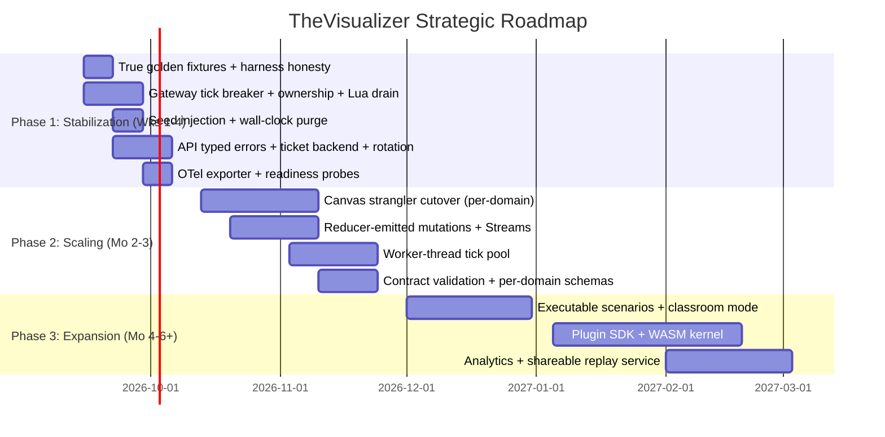

# TheVisualizer - Architectural Review & Strategic Roadmap

> Review cycle: 2026-09-09. Scope: full monorepo at 28 registered domains
> (`kafka, raft, database, redis, kubernetes, rabbitmq, storage, networking,
> rate-limiter, distributed-lock, cdn-cache, id-gen, transactions, llm-pipeline,
> llm-gateway, llm-serving, vectordb, gpu-cluster, load-balancer, search-index,
> task-scheduler, chat-presence, feature-store, model-rollout, llm-eval,
> consistent-hashing, probabilistic-structures, merkle-trees`).
> Evidence basis: source inspection with file:line citations plus executed runs —
> golden suite **89/89**, unit pool **428 passed + 1 skipped** (regen helper),
> API integration **42/42**, gateway runner integration **7/7**,
> recursive typecheck clean, zero new lint errors.
> Supersedes the prior 18-domain review; Section 1 notes where its VERIFIED claims
> were reconfirmed or overturned.
>
> Implementation status (2026-09-09, same session): Phase 1 items below marked
> [DONE] are merged into the working tree and verified by the runs above —
> committed SHA-256 golden vectors + throw-propagating harness + RNG-burn removal;
> gateway tick breaker, single-owner leases, atomic Lua drain, `hash(roomId,
> domainId)` seeds, monotonic event ids, per-session memory guard, pipelined
> Redis writes; API typed errors + pg-code conflict mapping + atomic
> authorize-and-mutate + cursor pagination + register-409 race handling +
> refresh rotation-reuse detection + `jti` claims + login bucket + deleted-user
> fail-closed + Redis WS-ticket backend + production JWT-secret gate + `/ready`
> probes; OTLP exporter wiring; migration `0002` (`memberships.org_id` index);
> CI Playwright job, soak-port fix, container-scan build-then-scan, readiness
> waits; throughput bench converted to report-only after 2.8k–10.7k/sec variance
> on identical code. NOT started: canvas strangler cutover (Phase 2),
> wire-contract validation, Streams migration, worker-thread pool.

## 1. Executive Summary & Health Assessment

### Project Metadata

- **Project Name**: TheVisualizer — deterministic distributed-systems / AI-infra simulation, visualization, and chaos-engineering platform.
- **Core Purpose & Target Audience**: Zero-I/O discrete-event simulation of 28 architectures (consensus, storage, networking, rate limiting, RAG, LLM serving, GPU parallelism, hashing/probabilistic primitives) with canvas visualizers, invariant checking, and fault injection. Audience: infrastructure engineers, SREs, students, platform teams doing protocol drills and failure-mode validation.
- **Current Tech Stack**: TypeScript 5.7 (strict incl. `noUncheckedIndexedAccess`, `exactOptionalPropertyTypes`), Node >=20 (CI: 24, Docker: 22), pnpm 11 + Turborepo 2, Next.js 15 / React 19 (`apps/web`), Hono 4 (`apps/api`), `ws` + msgpackr (`apps/ws-gateway`), Drizzle 0.38 + PostgreSQL 16, Redis 7, Vitest 2, Tailwind 3.4, Docker Compose, Cloud Run + Terraform.
- **Maturity Stage**: Scaling Production core / Mid-refactor shell. Simulation kernel is hardened; web shell and gateway integration lag one refactor behind the domain count.

### Overall System Maturity

| Dimension | Grade | Assessment Summary |
| :--- | :---: | :--- |
| **Architecture** | **B** | `DomainPlugin` registry (`packages/simulation/src/domains/registry.ts:148-186`, 28 plugins at `:1028-1057`) is exemplary. Dragged down by three asymmetries: `SimulationEngine` still Kafka-locked (`simulation-engine.ts:35,145`), gateway runs dual Kafka/generic paths (`apps/ws-gateway/src/gateway/runner.ts:78`), live web shell is a 5,114-line monolith. |
| **Code Quality** | **B+** | Strictest-tier TS config; invariant-first reducers; scrypt + constant-time auth. Offset by untyped seams (`scenarioLibrary: any[]`, `oracleAdapter?: any` at `registry.ts:184-185`; `state: any` in `simulation-store.ts:17`), string-matched error control flow in API routes, and `void rng.nextFloat()` test-gaming in ~11 reducers. |
| **Maintainability** | **C+** | `apps/web/src/app/VisualizerApp.tsx` (5,114 lines, 15 `setInterval`, 67 `useState`) is still the live shell (`page.tsx` renders it). 18-vs-28 drift across docs, tests, tokens, and scripts. `rag` + `agents` implemented/tested/exported but unregistered. Hash-ring and FNV-1a each implemented 3-4x. |
| **Performance** | **B** | Headless throughput clears its (weak) bar, canvas has pooling/culling. Gateway does **two full-tree JSON serializations per tick per room on the event loop** (`runner.ts:247`, `:483-485`, plus `room-manager.ts:221`), no workers, no pipelining. Throughput bench took 13s wall-clock for 5k ticks x 28 domains. |
| **Test Coverage** | **A-** | 426/427 unit pass; 88/88 golden pass; per-domain negative invariant tests are strong. Deductions: golden suite compares two in-process runs against no committed hashes (djb2, not SHA-256), throws are swallowed by harnesses, integration tests need hand-provisioned PG/Redis with mismatched credentials, Playwright E2E exists but runs nowhere in CI. |

### Architectural Philosophy

- **Core Strengths**:
  - **Pure reducer kernel**: `(state, event, rng) -> { nextState, emittedEvents }` across 28 domains, SplitMix32 RNG with fork/restore (`prng/deterministic-rng.ts:12-30`), per-tick invariant validation with halt-on-violation (`simulation-engine.ts:159-164`).
  - **Invariant-first pedagogy**: flaw spotlights (boundary burst `RL-3`, Kleppmann race `LOCK-4`, 2PC blocking `TXN-2`, clock-skew refusal `ID-3`) are first-class, with negative "checker catches tampered state" tests per domain.
  - **Hardened perimeter**: BOLA room ownership, access-only token enforcement, edge-aware IP extraction, 512 KB body caps, dummy-hash registration timing defense, TruffleHog/Trivy/SySBOM/axe/Lighthouse CI gates.
- **Fundamental Structural Risks**:
  - **Shelfware refactor**: Zustand store + canvas adapter exist but the store has zero production importers (only its own test imports it) and the adapter is a render-only switch fed by 19 parent-built prop bundles. The monolith was never actually retired.
  - **Server cannot reproduce clients**: uniform hardcoded seed `12345` in both gateway branches (`runner.ts:80,112`), `Date.now()`/`Math.random()` in event-id paths, non-atomic intent drain — server replays are not bit-reproducible despite the determinism brand.
  - **Contract drift**: gateway emits `EVENT_BATCH`/`INTENT_ACK`/`SESSION_ERROR` while `ServerMessageSchema` specifies `MSG_*` variants and is never imported by the gateway; `INTENT_DOMAIN_ACTION` payloads are untyped for 27 of 28 domains; exported `json-schemas/client-intent.json` predates 8 intents.

### Prior-Cycle Claim Reconciliation

| Prior claim | This cycle |
| :--- | :--- |
| Frontend decoupled, VisualizerApp <150 lines — VERIFIED | **OVERTURNED**. `VisualizerApp.tsx` is 5,114 lines and live; store is dead code; its own test fails (expects 18 domains, registry has 28). |
| Polymorphic gateway runner — VERIFIED | **PARTIAL**. Generic `INTENT_DOMAIN_ACTION` path exists (`runner.ts:172-294`) but Kafka hardcode remains (`:78`, `:315-453`); unknown `domainId` silently runs Kafka. |
| Single-query RBAC — VERIFIED | **CONFIRMED** for `getTopologyById` (LEFT JOIN). Update/delete paths remain 2-3 sequential non-transactional queries. |
| Prometheus cardinality — PENDING | **RESOLVED**. No `userId`/`roomId` labels; only bounded `room` gauge on `ws_active_connections` (`metrics.ts:31`). OTLP exporter still missing. |
| Vitest dual-pool + CI caching | **PARTIAL**. Root unit/integration configs exist (threads vs singleFork) but app-level `test:unit`/`test:integration` scripts reference nonexistent `--project` flags; ~10 CI jobs still rebuild unconditionally. |

### Primary Bottlenecks

1. **Live frontend monolith** (`apps/web/src/app/VisualizerApp.tsx`, 5,114 lines): 15 interval loops, 67 `useState` sites, per-domain handler sprawl. Every domain addition edits the highest-churn file; bundle ships all 18 legacy visualizers to every route.
2. **Gateway event-loop serialization**: per room per 100 ms tick — full-tree `JSON.parse(JSON.stringify())` clone, `fast-json-patch.compare` full-tree walk, `JSON.stringify` into Redis pub/sub, msgpackr `pack` — with tick duration observed but never acted on, and a throwing reducer retries at 10 Hz forever with no circuit breaker (`runner.ts:146,623-626`).
3. **Reproducibility and contract integrity**: uniform seed, wall-clock ids, swallowed harness exceptions, untyped generic intents, and stale exported schemas undermine the platform's core promise (deterministic, verifiable simulation).

---

## 2. In-Depth Engineering Review

### Design Patterns & Modularity

- **Simulation kernel — exemplary with extraction debt.** `DomainPlugin` cleanly separates factory / reducer / invariants / scenarios. But Kafka internals live in `engine/` instead of `domains/`; `src/transactions` vs `src/domains/transactions`, `src/storage` vs `src/domains/storage`, `src/domain` vs `src/domains` collide by name; only 8 of 28 plugin constants re-exported from `index.ts`; `SimulationEngine` bypasses the plugin abstraction (all engine features — snapshots, halting, limits — are Kafka-only). Reducer skeleton (`JSON.parse(JSON.stringify(state))` + `switch (event.type)` + rng stamp) pasted across ~29 files; `validateInvariants` wrapper pasted 28x in `registry.ts`.
- **Gateway — hybrid polymorphism.** Generic branch (`runner.ts:161-294`) is sound (plugin lookup, action dispatch, per-tick invariants, `EVENT_BATCH` only on non-empty patch). Kafka branch (`:296-621`) preserves legacy intents. Smells: `if (domainId === 'kafka' || !domainPlugin)` routes unknown domains into Kafka; three `INTENT_` normalization sites (`ws-server.ts:455-458`, `runner.ts:166-169,304-307`); unknown generic intents dropped without REJECTED ack; memory guard and tick ceiling exist only in the Kafka branch.
- **Web — monolith with decorating adapter.** `DomainCanvasAdapter.tsx` (107 lines) switches on `selectedDomain`, but the parent still owns all state, all 15 timers, and constructs all 19 prop bundles — coupling unchanged, one render hop added. `NewDomainsPanel` (domains 19-28) is self-contained (state + loop), creating a second, divergent client architecture inside the same shell. `useSimulationStore` (149 lines) would fix this and is tested, but nothing renders from it.
- **Contracts — Kafka-dominant.** `ClientIntentSchema` is 14 Kafka intents plus escape hatches (`JOIN_ROOM.domainId`, `INTENT_DOMAIN_ACTION` with `z.unknown()` payload). `DomainPlugin` redeclared in both `contracts/plugins.ts` and `simulation/registry.ts`. `api/` holds only `errors.ts` ("Full API definitions added incrementally in M06").

### Data Architecture & Persistence

- **Schema is polymorphic and indexed, with two gaps.** `topologies(domain_id, definition jsonb)` plus FK/composite indexes (`0001_huge_roxanne_simpson.sql`) are correct. `memberships.org_id` has no index (PK is `(user_id, org_id)`; `getMembers` filters by `org_id` — `org.repository.ts:50` — into seq scans), while `idx_memberships_user_id` redundantly duplicates the PK prefix. No Drizzle `relations()`; joins hand-written.
- **RBAC is half-joined.** `getTopologyById` is a single indexed LEFT JOIN (good). `createTopology` re-checks membership already verified by `requireOrgRole` middleware (double query per create); `updateTopology`/`deleteTopology` run SELECT-then-check-then-mutate across 2-3 sequential statements with no transaction (TOCTOU). No list endpoint exists — `listTopologiesForOrg` is dead — and no repository paginates.
- **Redis discipline is bounded but unpipelined.** Replay lists capped (`LTRIM 0 499` + 24h TTL, `runner.ts:285-287`) — the old OOM leak is fixed. Everything is sequential awaits: no `pipeline`/`multi`, no Streams. Intent drain is LRANGE-then-LTRIM (non-atomic across nodes); `room:<id>:intents` has no TTL; `simulation_replays` table has no writer or reader anywhere.
- **`'kafka'` defaults persist** in `schema.ts:57`, `topology.repository.ts:38`, `topology.routes.ts:14,46` — harmless today, a landmine for multi-domain persistence later.

### Error Handling & Fault Tolerance

- **Tick-loop failure mode is the sharpest edge.** Reducer throw is caught by the outer tick try/catch with `logger.error` + bare return — no `captureException`, no consecutive-failure counter, no halt. A deterministically throwing plugin loops errors at 10 Hz indefinitely. Poisoned single intents are handled correctly (per-intent catch + continue).
- **Crash recovery loses up to 5s.** Keyframes every 50 ticks at 10 Hz; no journal; in-memory sessions vanish on crash while Redis keys persist (owner/replays TTL'd, intents list not). Reaper is per-process (`roomLastActivity` in-memory) so crashed rooms' keys outlive any cleaner.
- **API errors flow through message strings.** Duplicate-key via `err.message?.includes('duplicate key')` (`org.routes.ts:39-40`) instead of pg code `23505`; authorization via `includes('Unauthorized')/includes('rights')` (`topology.routes.ts:162,210`); `err.message` echoed into 500 bodies (`:59,179,227`). Register has a check-then-insert race with no conflict mapping (concurrent duplicate -> 500, not 409). `POST /orgs` and `POST /topologies` return 200, not 201.
- **Auth is strong with three holes.** scrypt + `timingSafeEqual` + dummy-hash anti-enumeration; refresh rejected where access required. Holes: deleted-user fallback trusts JWT claims when the DB lookup fails (`auth.middleware.ts:69-75`); no refresh rotation-reuse detection; `wsTicketStore` never receives its Redis backend so API-minted tickets are unconsumable by the gateway (cross-process dead), and `JWT_SECRET` falls back to `SESSION_SECRET` in both services.

### Observability & Diagnostics

- **Metrics: fixed.** Prior cardinality concern is resolved — labels are `method/route/status`, `type`, `reason`, `tier`, `domain`, `invariant`, plus one bounded `room` gauge. `route` is templated (`logging.middleware.ts:45`).
- **Tracing: instrumented to nowhere.** `otel.ts` starts `NodeSDK` with auto-instrumentation but no exporter, no `@opentelemetry/exporter-*` dependency, no OTLP env wiring — spans buffer and die in-process. Zero `OTLP|otlp|exporter` hits across `apps/` + `packages/`.
- **Diagnostics: good.** `ErrorBoundary` with sanitized dumps + clipboard export; per-room sequence buffer (cap 50) with `GAP_RECOVERY`/`INIT_SNAPSHOT_REQUIRED`; Prometheus `/metrics` on API and gateway; `withTraceContext` log correlation ready for the day traces exist.
- **Blind spots**: tick duration recorded but never acted on (no slow-tick shed); API `/health` is liveness-only (no DB/Redis readiness); no alerting thresholds defined in repo (rollback runbook cites >1% 5xx / P95 >200 ms but nothing emits those signals per-service here).

### Testing & Quality Assurance

- **Executed this cycle**: golden `88/88` (2.71s); full unit pool `426/427` files `63/64` (21.5s). The single failure is `simulation-store.test.ts:47` asserting 18 domains against a 28-domain registry — a stale assertion inside dead code, but also proof the store rots unmaintained.
- **Golden suite is misnamed.** `stableHash` is djb2-32 (`golden-determinism.test.ts:20-28`), not SHA-256; `GOLDEN_TICKS = 10`, not 100/500; no literal committed hashes — each test runs the pipeline twice in-process and asserts `h1 === h2`, which cannot catch cross-version or cross-platform drift. `runGoldenSequence` try/catch (`:50-56`) lets a crashing reducer pass as a no-op. ~11 reducers contain `void rng.nextFloat()` burns solely to satisfy the different-seeds-diverge test (`feature-store:159`, `chat-presence:246`, `consistent-hashing:279`, et al.).
- **Strengths are real**: per-domain negative invariant tests (tampered-state rejection) across chat-presence, feature-store, llm-eval, model-rollout, task-scheduler, load-balancer, search-index, consistent-hashing, probabilistic-structures, merkle-trees, vectordb, gpu-cluster; Kafka 8-invariant checker with 7+7 unit/fidelity tests; engine halts on violation.
- **Pipeline gaps**: Playwright specs (`e2e/all-domains`, `platform-workflows`, `prod-regression-13x5`) run in no CI job; integration tests require live PG/Redis with DSNs mismatching `docker-compose.yml` (`visualizer:visualizer_local@.../visualizer_dev` vs `visualizer_user:.../visualizer_db`) plus an `ALTER TABLE ... ADD COLUMN IF NOT EXISTS` drift hack in `beforeEach`; throughput assertion (`>= 5,000 ticks/sec`) is machine-dependent and mostly measures JSON clone overhead since bare TICKs no-op; `fast-check` installed but never imported.

---

## 3. Critical Modifications & Technical Debt Remediation

| Priority | Category | Component / Module | Issue / Technical Debt | Impact If Ignored | Recommended Fix |
| :---: | :--- | :--- | :--- | :--- | :--- |
| **P0** | Architecture | `apps/web/src/app/VisualizerApp.tsx` (5,114 lines, live via `page.tsx`) | Monolith intact: 15 `setInterval`, 19 `useEffect`, 67 `useState`; adapter is render-only; store has zero production importers | All domain work funnels through highest-churn file; full-legacy bundle on every route; store rots (its test already fails) | Strangler cutover per domain to `useSimulationStore` + data-driven lazy canvas registry; delete 19-prop switch (pattern below) |
| **P0** | Resilience | `apps/ws-gateway/src/gateway/runner.ts:146,623-626` | Reducer throw -> log + return; next tick retries same transition at 10 Hz forever; no `captureException` | Hot error loop masks deterministic crashes; Sentry blind on the exact path that matters | Consecutive-failure counter -> `haltSession` + `captureException` after N (pattern below) |
| **P0** | Correctness | `runner.ts:152-155` + `ws-server.ts:376` | Non-atomic LRANGE/LTRIM intent drain; every join node starts its own session for the same room | Two nodes drain the same queue and diverge; per-node sequences break GAP_RECOVERY cross-node | Single session owner via `SET room:<id>:runner <node> NX PX 15000` + heartbeat; Lua atomic drain (pattern below) |
| **P0** | Correctness | `runner.ts:80,112,178,458` | Uniform seed `12345` per domain; `Date.now()`/`Math.random()` in event-id paths | Server replays not reproducible; RNG streams correlated across rooms; violates zero-unseeded-entropy rule | Seed `hash(roomId, domainId)`; monotonic per-session id counters; purge wall-clock from event paths |
| **P1** | Correctness | `golden-determinism.test.ts:20-56,134-135` | djb2 self-comparison, no committed hashes, throw-swallowing harness, `void rng` burns in ~11 reducers | Suite cannot catch cross-version drift; crashes read as passes; fake entropy | Commit literal SHA-256 fixtures; fail on throw; delete burns, give seed-indifferent domains honest fixed streams (pattern below) |
| **P1** | Architecture | gateway egress vs `packages/contracts/src/websocket/index.ts:157-201` | Gateway emits `EVENT_BATCH`/`INTENT_ACK`/`SESSION_ERROR`; schema specifies `MSG_*` shapes and is never imported by gateway; `INTENT_DOMAIN_ACTION` payload untyped | Wire drift breaks any third-party client; 27 domains have no typed intent contract | Validate egress against `ServerMessageSchema` in tests; regenerate `json-schemas/`; per-domain action schemas keyed by registry metadata |
| **P1** | Security | API <-> gateway auth bridge | `wsTicketStore` in-memory only (backend setter never called) so tickets are cross-process dead; `JWT_SECRET \|\| SESSION_SECRET` fallback; no refresh-rotation reuse detection | Multi-instance ticket flow broken; key-confusion risk; stolen rotated refresh stays valid to expiry | Redis backend for ticket store; distinct required secrets; revoke-on-rotate with reuse detection |
| **P1** | Data | `topology.repository.ts:137-179`, `topology.routes.ts:162,210`, `org.routes.ts:39-40` | String-matched pg/authorization errors; `err.message` in 500s; 2-3 step non-transactional update/delete; register race; double membership check on create; no list endpoint; no pagination | Wrong status codes leak internals; TOCTOU on authz; concurrent register 500s; unbounded reads later | Typed `AppError` + `err.code === '23505'`; transactional mutate; `ON CONFLICT` -> 409; single membership check; `GET /topologies` with cursor pagination |
| **P1** | Resilience | `runner.ts:570-586` | 256/512 MB **process-global** guard halts whichever room ticks next; absent from generic branch; `maxMemoryMb: 128` dead | Unrelated tenants halted; 19-28 domains unguarded | Per-session byte accounting; extend guard to generic path; enforce configured cap |
| **P1** | Observability | `packages/logging/src/otel.ts` | No exporter, no exporter dep, no OTLP env | Tracing is decoration; production incidents get logs only | Add `@opentelemetry/exporter-trace-otlp-http` + `OTEL_EXPORTER_OTLP_ENDPOINT` wiring |
| **P2** | Maintainability | simulation duplication | `JSON.parse(JSON.stringify())` x~24 reducers; `switch(event.type)` x29; FNV-1a x4; hash-ring x3; `clamp` x9; tamper-clone x~40 tests; `validateInvariants` wrapper x28 | Copy-paste drift (already visible: `database/hash-ring.ts` vs `consistent-hashing-algorithms.ts` vs `load-balancer-algorithms.ts`) | Shared `deepClone`, `createReducer`, `clamp`, canonical `fnv1a32`, single ring module; codemod the call sites |
| **P2** | Tooling/DX | configs, scripts, CI | App `test:unit`/`test:integration` reference nonexistent `--project`; `verify-all-18-domains.mjs` asserts 28 with 18-era strings; sim-cli usage lists 8; `run-lighthouse-18` covers 18 routes; nightly-soak sets unread `WS_GATEWAY_PORT`; container-scan builds dist-less Dockerfiles; e2e absent from CI | Broken local scripts; soak tests the wrong port; container scan vacuous; E2E unprotected | Fix flags to root configs; rename/alias verify script + fix strings; add Playwright CI job; fix soak port; build-then-scan; `sleep` -> healthcheck waits |
| **P2** | Data/DX | schema + tests | `memberships.org_id` unindexed; `idx_memberships_user_id` redundant; test DSNs mismatch compose; `ALTER TABLE` drift hack in tests; `simulation_replays` unwritten | Org-member reads seq-scan; onboarding friction; dead table confuses | Add `(org_id)` index, drop redundant one; compose-matched test DSN + migrate-first harness; either wire replays or drop table |
| **P2** | Platform | shared packages | `config` RESOURCE_LIMITS Kafka-shaped; `test-utils` Kafka-only + dead `prng.ts` stub; `ui` DOMAIN_COLORS 8/28; `fast-check` unused | New domains inherit wrong caps/colors; no factories for 27 domains | Generic per-category limits; domain factories; 28 color tokens; use fast-check for invariant fuzz or remove |

### Before/After: P0 strangler cutover for the canvas shell

Before — parent builds every prop bundle; adapter only switches (`VisualizerApp.tsx:4775-4819`, `DomainCanvasAdapter.tsx:25-51`):

```typescript
// Parent still owns 19 states, 15 timers, all handlers — adapter changes nothing.
<DomainCanvasAdapter
  selectedDomain={selectedDomain}
  kafkaComponent={<Visualizer state={renderedState} producers={producers} /* ... */ />}
  raft={{ state: raftState, onProposeCommand: handleRaftProposeCommand /* ... */ }}
  database={{ state: dbState /* ... */ }}
  // ... 16 more bundles, all constructed on every render
/>
```

After — data-driven registry; shell owns zero domain state:

```typescript
// apps/web/src/components/domains/domain-canvas-registry.ts
import dynamic from 'next/dynamic';

export const DOMAIN_CANVASES = {
  kafka: dynamic(() => import('../kafka/KafkaVisualizer')),
  raft: dynamic(() => import('../raft/RaftVisualizer')),
  // ... one lazy entry per DomainKey; NewDomainsPanel entries likewise
} as const satisfies Record<DomainKey, React.ComponentType<{ state: unknown }>>;

// Shell: single timer, single state subscription.
export default function VisualizerApp({ initialDomain }: { initialDomain: DomainKey }) {
  const { domainId, state, violation, isPaused, tickRateMs, step, setDomain } = useSimulationStore();
  useEffect(() => { if (initialDomain !== domainId) setDomain(initialDomain); }, [initialDomain]);
  useEffect(() => { if (isPaused) return; const t = setInterval(step, tickRateMs); return () => clearInterval(t); },
    [isPaused, tickRateMs, step]);
  const Canvas = DOMAIN_CANVASES[domainId];
  return (
    <ErrorBoundary fallbackTitle={`${domainId} Visualizer Fault`}>
      <Canvas state={state} />
      {violation && <InvariantBanner violation={violation} />}
    </ErrorBoundary>
  );
}
```

Cut over one domain per PR (kafka last — it has the bespoke `visualizer.tsx` particle canvas); each cutover deletes its `useState` block, timer, and handlers from `VisualizerApp.tsx`. Also fix the store first: `state: any` -> `unknown` + per-domain narrowing, `Date.now()` id -> monotonic counter, and `loadScenario` must not call `scenario.setup` (the shipped `ScenarioDefinition` shape has no `setup` field — invoking it today throws).

### Before/After: P0 gateway session ownership + atomic drain + tick circuit breaker

Before — racy drain, fire-and-forget ticks, silent retry (`runner.ts:134-155`, `:623-626`):

```typescript
session.timer = setInterval(() => { void this.executeTick(session); }, 100);
// ...
const intents = await this.redis.lrange(key, 0, 49);
await this.redis.ltrim(key, 50, -1); // another node may drain the same range
// ...
} catch (err) { logger.error({ err }, 'Error executing simulation tick'); return; }
```

After:

```typescript
// Ownership: only one node ticks a room. Heartbeat refreshes the lease.
const owner = await this.redis.set(`room:${roomId}:runner`, nodeId, 'PX', 15000, 'NX');
if (owner !== 'OK') return; // another node owns this room
// Atomic drain via Lua (LRANGE+LTRIM as one op), pipelined with LLEN.
const drain = await this.redis.eval(
  `local xs = redis.call('LRANGE', KEYS[1], 0, 49)
   redis.call('LTRIM', KEYS[1], 50, -1)
   return xs`, 1, `room:${roomId}:intents`);

// Tick circuit breaker.
} catch (err) {
  session.consecutiveFailures += 1;
  captureException(err, { roomId });
  if (session.consecutiveFailures >= 5) {
    await this.haltSession(roomId, `Tick failed ${session.consecutiveFailures}x consecutively`);
  }
  return;
}
// on success: session.consecutiveFailures = 0;
```

Pair with: per-session memory accounting (accumulate `Buffer.byteLength(JSON.stringify(snapshot))` deltas instead of `process.memoryUsage()`), and extend the guard to the generic branch.

### Before/After: P1 true golden fixtures

Before — self-comparison with djb2 and swallowed throws (`golden-determinism.test.ts:20-56`):

```typescript
function stableHash(o: unknown): number { /* djb2 over JSON.stringify */ }
function runGoldenSequence(...) { try { /* reduce */ } catch { /* ignore -> passes */ } }
const h1 = runGoldenSequence(...); const h2 = runGoldenSequence(...);
expect(h1).toBe(h2); // proves nothing across versions
```

After:

```typescript
import { createHash } from 'node:crypto';
const sha = (o: unknown) => createHash('sha256').update(JSON.stringify(o)).digest('hex');
// Committed vectors — changing engine semantics requires intentionally updating these.
const GOLDEN_VECTORS: Record<string, { seed: number; ticks: number; sha256: string }> = {
  'kafka:tick10': { seed: 12345, ticks: 10, sha256: '9f2c…' },
  // ... one vector per domain (28), regenerated by `pnpm sim:golden:update`
};
for (const [key, v] of Object.entries(GOLDEN_VECTORS)) {
  it(`golden ${key}`, () => {
    const end = runGoldenSequence(key, v.seed, v.ticks); // throws propagate — no try/catch
    expect(sha(end)).toBe(v.sha256);
  });
}
```

And delete the `void rng.nextFloat()` burns: for seed-indifferent domains, derive the stream honestly (`rng.fork(domainId)` consumed by real jitter) or assert fixed-point behavior explicitly instead of faking divergence.

---

## 4. Optimization & Enhancement Recommendations

### Performance & Scalability

- **Redis pipelining first (hours, no design risk)**: batch replay `LPUSH`+`LTRIM`+`EXPIRE`, intent drain + `LLEN`, publish paths. Eliminates ~4 roundtrips per room per tick/keyframe at 10 Hz.
- **Kill the double full-tree serialization**: derive patches from reducer-emitted mutation paths (`{ nextState, emittedEvents, mutations? }` on `DomainPlugin.reduceState`), falling back to `fast-json-patch.compare` only for legacy reducers. Removes one of the two per-tick clones immediately.
- **Worker-thread tick pool**: move `reduceState` + invariant check off the gateway event loop (`worker_threads`, one worker per N rooms, structured-clone states). Heartbeats and framing stop depending on the slowest room's tick.
- **Migrate replay + intents to Redis Streams** (`XADD MAXLEN ~ 1000`, consumer groups): atomic append/trim, multi-consumer replay rendering, and the natural substrate for the ownership/leader-election fix.
- **Web bundle**: per-domain `next/dynamic` canvases (see pattern above) so `/kafka` stops shipping 27 other visualizers; prerender all 28 routes statically (today only the 18-era set + `[domain]` fallback exist in `.next/server/app`); move tick stepping for hidden tabs to `requestAnimationFrame`-gated or paused state.
- **Connection hygiene**: `pg` pool sets no `idleTimeoutMillis`/`connectionTimeoutMillis`/`application_name` (`apps/api/src/db/index.ts:13-21`); API rate limiter and gateway both open independent Redis clients (4 per gateway node) — share via a single multiplexer.

### Developer Experience (DX) & Tooling

- **Repair the test script split**: point app-level `test:unit`/`test:integration` at the root configs or delete them; document `pnpm test:unit` (threads, ~22s) vs `pnpm test:integration` (singleFork, needs PG+Redis). Fix the one failing stale assertion (`simulation-store.test.ts:47`: 18 -> 28) or, better, assert against `DomainRegistry.list().length` dynamically.
- **One-command integration env**: align test DSNs with `docker-compose.yml`, add `pnpm test:integration:up` (compose pg+redis, `db:migrate`, run, down), and remove the `ALTER TABLE ... IF NOT EXISTS` drift hacks by migrating first.
- **CI in this order**: add the missing Playwright E2E job; build-then-scan for `container-scan` (today it builds dist-less Dockerfiles); fix `WS_GATEWAY_PORT` vs `PORT` in `nightly-soak.yml`; share one build across jobs instead of ~10 rebuilds; replace `sleep 4/5` with healthcheck waits; add a Node-version matrix or pin engines to what ships (CI 24 vs Docker 22 vs `>=20` claim).
- **Scaffolding honesty**: `create-domain.mjs` should emit plugin registration + contract schemas + golden vector stub + docs-row update, and `check-domain-counts.mjs` / `verify-all-*.mjs` / lighthouse route lists should read the registry instead of hardcoding 18/20/28.
- **Docs rollup**: single 28-domain pass over `FEATURE_EXPLAINER.md`, `MASTER_PLAN.md` (still "8 domain visualizers"), `DELIVERABLES_DONE.md`, `CHANGELOG.md` (single 1.0.0 entry), audit scorecards, and `RUNBOOK.md` ports table (Web 3000/WS 8080/API 3001 vs compose 3002/3001/3000).

### Security & Hardening Quick-Wins

- Fix the ticket bridge (Redis backend for `wsTicketStore`) — currently the only auth flow that is structurally broken across processes.
- Require distinct `JWT_SECRET` (remove `SESSION_SECRET` fallback); add refresh-rotation reuse detection; remove deleted-user JWT fallback or scope it to a short grace with explicit logging.
- Per-route stricter limiter on `/auth/login` (brute-force needs less than the global 60-token bucket); make `cf-connecting-ip`/`x-real-ip` trust conditional on a `TRUSTED_PROXY` flag; split the shared `ip-unknown` bucket by connection fingerprint.
- Replace string-matched pg/authz errors with `err.code === '23505'` and a typed `AppError` hierarchy; stop echoing `err.message` in 500s; return 201 on creates.
- `definition` validation: dispatch on `domain_id` to per-domain Zod schemas (at minimum structural: required top-level keys per plugin metadata) instead of `z.record(z.string(), z.unknown())`.
- Web: set an explicit CSP (currently absent from `secureHeaders`), and move CORS ahead of the rate limiter or exempt `OPTIONS` so preflights stop consuming tokens.

---

## 5. Future Engineering & Feature Roadmap



### Phase 1: Stabilization & Hardening (Short-Term: Weeks 1-4)

Immediate debt fixes, harness honesty, and operational guardrails. No new user features.

- True golden fixtures (P1 pattern above): SHA-256 committed vectors x28, throw-propagating harness, `void rng` burns deleted, `pnpm sim:golden:update` regeneration script.
- Gateway: consecutive-failure breaker + `captureException`, single-owner sessions + atomic Lua drain, `hash(roomId, domainId)` seeds, monotonic ids, per-session memory accounting extended to the generic branch.
- API: typed errors + pg codes, transactional mutations, register `ON CONFLICT` -> 409, 201 creates, no `err.message` in 500s, Redis ticket backend, rotation-reuse detection, distinct secrets, login-specific rate limit.
- Observability: OTLP exporter wired, `/ready` probes (PG + Redis pings) on API/gateway, compose `healthcheck` + `condition: service_healthy` for all services, fix `kafka-visualizer-*` container names.
- Test/CI: fix `--project` scripts, compose-aligned integration env, stale-assertion fix, Playwright E2E job added, soak port + container-scan + sleep-waits fixed.

### Phase 2: Architectural Scaling & Performance (Medium-Term: Month 2-3)

Modular refactoring, query/stream optimization, horizontal-scaling prep.

- Canvas strangler: one domain per PR onto store + lazy registry, kafka last; delete dead `visualizer.tsx` fork paths as domains migrate; fix `loadScenario` (`scenario.setup` does not exist on shipped scenarios — make scenarios executable event scripts first).
- Reducer-emitted mutation paths; Redis Streams for intents + replays; pipelined everything; worker-thread tick pool with slow-tick shedding.
- Contract enforcement: gateway egress validated against `ServerMessageSchema` in integration tests; regenerated `json-schemas/`; per-domain `INTENT_DOMAIN_ACTION` schemas; `SessionLimitsSchema` generalized beyond brokers/partitions.
- Data: `(org_id)` index, drop redundant index, cursor-paginated `GET /topologies`, single membership check, `simulation_replays` wired (server-persisted replays) or dropped, `definition` per-domain validation.
- Simulation dedupe: shared `deepClone`/`createReducer`/`clamp`/`fnv1a32`/ring; generalize `SimulationEngine` over `DomainPlugin` (or delete it in favor of registry-driven runners); register-or-remove decision on `rag`/`agents` (they are currently tested dead code).

### Phase 3: Next-Generation Feature Expansion (Long-Term: Month 4-6+)

| Feature Name | Business / Technical Value | Complexity | Architectural Prerequisites |
| :--- | :--- | :---: | :--- |
| Executable Scenario Studio + time-travel | Educators author runnable failure drills (event scripts, not prose steps); root-cause annotation; exportable `.scenario.json` | Med | Scenario `events` populated for 28 domains; true golden fixtures; Streams-backed replay |
| Multi-player classroom + assessment | Presenter/student rooms, live presence, auto-grading against invariant rubrics | High | Session ownership; typed intents; per-user (not per-socket) rate limits |
| Custom Domain Plugin SDK (GA) | Third-party protocols as first-class domains via `DomainPluginBuilder` | Med | `scenarioLibrary`/`oracleAdapter` typed; engine generalized; docs + versioned plugin API |
| WASM simulation kernel | Offline desktop/mobile, edge execution, zero-Node embeds | High | `Date.now` shimmed out of 7 prod files; Node-only tests guarded; `fast-json-patch` bundled |
| Replay persistence service | Server-stored shareable replays; permalink v2 backed by content hashes | Med | `simulation_replays` writer/reader; Streams keyframes; storage backend (R2/GCS) |
| Cross-domain analytics dashboard | Tick/invariant/violation telemetry per domain; perf HUD data server-side | Low | OTLP traces live; cardinality-safe metric labels (already clean) |

---

## 6. Technical Decision Log (ADR Recommendations)

### ADR-001: Generalize `SimulationEngine` over `DomainPlugin` vs delete it

- **Context**: Engine features (snapshots, halting, resource limits, oracle harness) are Kafka-only while 27 other domains bypass them; two execution models coexist.
- **Decision**: Generalize the engine to drive any `DomainPlugin` (registry lookup by `domainId`, plugin-supplied invariant mapping). If generalization costs more than two weeks, delete `SimulationEngine` and standardize on registry-driven runners + `ScenarioStudio` primitives.
- **Consequences**: Positive — one execution model, engine features for all 28 domains. Negative — Kafka E2E/oracle tests need porting to the generalized path.

### ADR-002: Redis Streams + single-owner sessions for gateway state

- **Context**: Non-atomic list drain, per-node duplicate sessions, TTL-less intent keys, replay lists with no consumers.
- **Decision**: Streams (`XADD MAXLEN ~ 1000`) with consumer groups for intents and replays; `SET NX PX` session ownership with heartbeats; per-node sequence numbers replaced by stream IDs for gap recovery.
- **Consequences**: Positive — horizontal gateway scaling becomes safe; replay consumers decoupled. Negative — `LRANGE`/`GAP_RECOVERY` clients migrate to `XRANGE`; local single-node dev needs Redis regardless (already true).

### ADR-003: Committed SHA-256 golden vectors as the determinism contract

- **Context**: Self-comparison djb2 suite cannot detect cross-version drift; RNG burns fake entropy; throws pass silently.
- **Decision**: 28 committed SHA-256 vectors, throw-propagating harness, regeneration script requiring explicit engineer sign-off on vector changes (treat vector diffs like snapshot updates in review).
- **Consequences**: Positive — determinism becomes enforceable. Negative — intentional semantics changes require vector regeneration; seed-indifferent domains need explicit fixed-point assertions.

### ADR-004: Strangler cutover (per-domain) vs rewrite of the web shell

- **Context**: 5,114-line live monolith vs 149-line tested-but-unwired store; kafka canvas is bespoke (particles, triggers); domains 19-28 already self-contained in `NewDomainsPanel`.
- **Decision**: Strangler — migrate one domain per PR behind the lazy canvas registry, kafka last; keep `VisualizerApp.tsx` compiling and shrinking each merge. No big-bang rewrite, no long-lived branch.
- **Consequences**: Positive — shippable increments, E2E guards each step. Negative — temporary dual state models during migration; discipline required to delete (not just bypass) migrated code.
