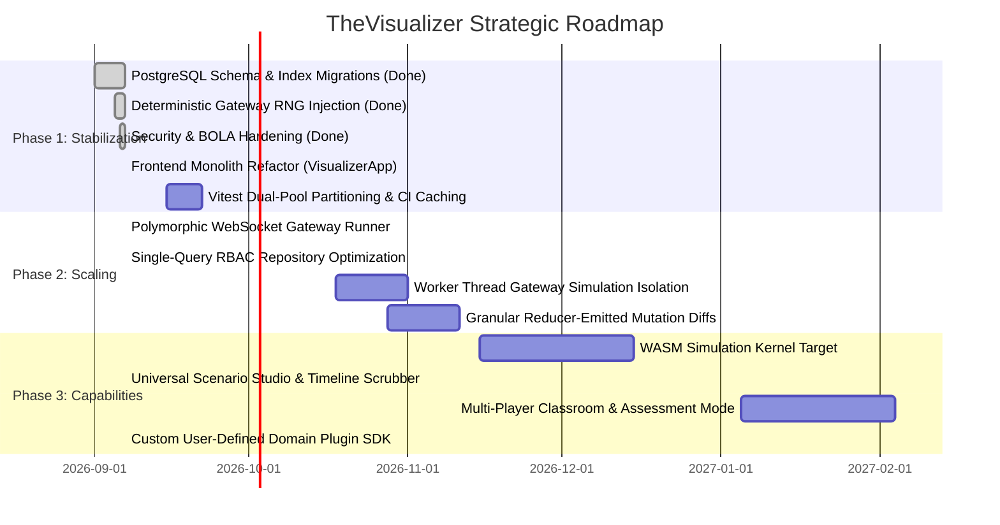

# TheVisualizer - Architectural Review & Strategic Roadmap

## 1. Executive Summary & Health Assessment

### Project Metadata
- **Project Name**: TheVisualizer (Enterprise Discrete-Event Distributed Systems & AI Infrastructure Simulator)
- **Core Purpose & Target Audience**: High-fidelity, deterministic visualization and chaos-engineering platform for 18 distributed systems and AI infrastructure domains (e.g., Kafka, Raft, Cassandra, Redis Cluster, ClickHouse, Postgres WAL, Envoy Mesh, Token Bucket, 2PC, LLM Tokenizer, Transformer Attention, PagedAttention/vLLM, MoE Routing, Vector DB HNSW, GPU Cluster 3D Parallelism). Targeted at staff/principal infrastructure engineers, distributed systems students, and platform teams for interactive architecture drills, protocol exploration, and failure-mode validation.
- **Current Tech Stack**: TypeScript 5.8, Node.js 22, Hono 4.7 (`apps/api`), `@fastify/websocket` / `ws` (`apps/ws-gateway`), React 19 / Next.js 15 App Router (`apps/web`), Drizzle ORM 0.38 + PostgreSQL 16 (`apps/api`), Redis 7.2 (`apps/ws-gateway`), Turborepo 2.4 monorepo, Vitest 3.0, Tailwind CSS 3.4, Docker Compose, Google Cloud Platform (Cloud Run, Cloud SQL, Secret Manager, VPC Connector, Terraform).
- **Maturity Stage**: Production-Hardened Core Engine / Scaling Platform Refactor. Core simulation algorithms and security boundaries are hardened; application shell requires decoupling to achieve full platform polymorphism.

### Overall System Maturity

| Dimension | Grade | Assessment Summary |
| :--- | :---: | :--- |
| **Architecture** | **B+** | Core discrete-event engine (`packages/simulation`) is pure, decoupled, and mathematically sound. Application tier has been partially generalized (`topologies.domain_id` migration complete), but WebSocket runner and frontend UI shell retain legacy Kafka-centric coupling. |
| **Code Quality** | **A-** | Strict TypeScript configuration, zero `any` in core simulation types, robust invariant assertions, validated mathematical mechanics (CUBIC congestion, PagedAttention block tables, HNSW heuristic pruning, 1F1B pipeline bubbles). |
| **Maintainability** | **C+** | High cognitive overhead in client layer. `apps/web/src/app/VisualizerApp.tsx` spans 5,137 lines with 18 manual `useEffect` loops and 30+ disparate `useState`/`useRef` hooks rather than a unified store. |
| **Performance** | **A-** | Headless simulation executes at 43,265 ticks/sec. Canvas rendering utilizes entity pooling and frustum culling. Main bottlenecks: gateway JSON delta diffing (`fast-json-patch.compare` on full state trees) and serialized CI test execution (`singleFork: true`). |
| **Test Coverage** | **A** | 68/68 golden determinism fixtures, 23/23 behavioral automated checks, 293 unit tests, 73 integration tests, comprehensive penetration testing suite (BOLA, token scope, rate-limiting, timing attacks), and killed mutation test suites. |

### Architectural Philosophy
- **Core Strengths**:
  - **Zero-Entropy Deterministic Discrete-Event Simulation (DDES)**: Strict separation of state transition reducers (`pureStateTransition`) driven by an explicit pseudo-random number generator (`DeterministicRNG` based on SplitMix32). Replays reproduce bit-identical states from seed + input logs across any environment.
  - **Invariant-First Safety Verification**: Invariant validators execute concurrently with state mutations, identifying protocol violations (e.g., Raft leader append-only invariance, Cassandra quorum intersection, Kafka ISR monotonicity, PagedAttention block reference consistency) at the exact logical tick of divergence.
  - **Pedagogical Flaw & Chaos Injection**: Dedicated fault-injection primitives model real-world infrastructure edge cases (split-brain partitions, Kleppmann stop-the-world GC pauses, 2PC coordinator crashes, network asymmetric delays, Lost-in-the-Middle context degradation).
- **Fundamental Structural Risks**:
  - **Asymmetric Gateway Support**: While `packages/simulation` supports 18 polymorphic domains via `DomainPlugin`, `apps/ws-gateway/src/gateway/runner.ts` and `packages/contracts/src/websocket/index.ts` remain wired exclusively to `KafkaClusterState` and Kafka client intents (`INTENT_PRODUCE`, `INTENT_CONSUMER_JOIN`). Non-Kafka domains operate strictly client-side in browser memory.
  - **Frontend State Monolith**: `apps/web/src/app/VisualizerApp.tsx` violates Single Responsibility and Open-Closed principles by aggregating canvas management, simulation loops, controls, and inspectors for all 18 domains into a single 5,137-line component.
  - **Real-Time State Serialization Overhead**: Gateway tick broadcaster performs full-tree serialization on every tick (`JSON.parse(JSON.stringify(state))`) to compute RFC 6902 JSON patches, consuming excess CPU and memory during multi-room concurrent execution.

### Primary Bottlenecks
1. **Frontend State Monolith (`apps/web/src/app/VisualizerApp.tsx`)**: 5,137 lines of imperative React code managing 18 manual simulation `setInterval` timers, causing unnecessary re-renders, high bundle weight, and fragile maintenance.
2. **Asymmetric Protocol Architecture**: Absence of generic wire contracts and polymorphic gateway runners for non-Kafka domains. Non-Kafka simulations cannot run headlessly, collaboratively in multi-user rooms, or persist server-authoritative replays.
3. **Gateway Serialization & Worker Contention**: Gateway runs simulation execution, delta patch calculation, and WebSocket framing sequentially inside the Node.js event loop. Heavy simulation workloads delay event-loop scheduling and socket heartbeats for unrelated concurrent rooms.

---

## 2. In-Depth Engineering Review

### Design Patterns & Modularity
- **Simulation Layer (`packages/simulation`)**: Exemplary domain registry architecture. `packages/simulation/src/domains/registry.ts` cleanly models each domain as a `DomainPlugin<TState, TEvent>` exposing:
  - `createDefaultState()`: Pure initial factory.
  - `reduceState(state, event, rng)`: Pure state transition returning `{ nextState, producedEvents }`.
  - `validateInvariants(state)`: Safety assertion pipeline.
  - `scenarioLibrary`: Curated educational failure modes.
- **Gateway Layer (`apps/ws-gateway`)**: Strong modularity in room session and connection tracking (`RoomManager`, `WsServer`), but tightly coupled in execution logic:
  - `SimulationRunner` (`apps/ws-gateway/src/gateway/runner.ts`) directly instantiates `SimulationEngine`, which is hardcoded to Kafka.
  - Lines 155–205 of `runner.ts` use explicit `if/else` checks strictly for Kafka intents (`INTENT_PRODUCE`, `INTENT_CONSUMER_JOIN`, `INTENT_CHAOS_KILL_BROKER`).
  - `INTENT_RESET` (line 237) blindly initializes `DEFAULT_TOPOLOGY` (Kafka), resetting any room regardless of its registered `domainId`.
- **Contracts (`packages/contracts`)**:
  - `packages/contracts/src/websocket/index.ts` exposes `ClientIntentSchema`, which contains only Kafka actions. Intents for Raft elections, Cassandra quorum adjustments, or VectorDB index rebuilds do not exist in wire contracts.
- **Frontend Layer (`apps/web`)**:
  - `apps/web/package.json` installs `zustand` (v5.0.3) and `@xyflow/react` (v12.4.3), but neither library is imported anywhere in `apps/web/src`.
  - Instead of utilizing Zustand stores or the polymorphic `DomainPlugin` registry, `VisualizerApp.tsx` declares 18 individual `useState` hooks, 18 separate `DeterministicRNG` refs, and 18 separate `useEffect` loops.

### Data Architecture & Persistence
- **Schema Design (`apps/api/src/db/schema.ts`)**:
  - Migration `0001_huge_roxanne_simpson.sql` successfully decoupled the `topologies` table by adding:
    - `domain_id varchar(64) DEFAULT 'kafka' NOT NULL`
    - Generic `jsonb('definition').$type<Record<string, unknown>>().notNull()`
  - Explicit B-tree foreign key and composite indexes were added:
    - `idx_topologies_org_id` on `topologies(org_id)`
    - `idx_topologies_created_by` on `topologies(created_by)`
    - `idx_topologies_domain_org` on `topologies(domain_id, org_id)`
    - `idx_topologies_visibility` on `topologies(visibility)` WHERE `visibility = 'PUBLIC'`
    - `idx_simulation_replays_topology_id` on `simulation_replays(topology_id)`
    - `idx_simulation_replays_created_by` on `simulation_replays(created_by)`
    - `idx_memberships_user_id` on `memberships(user_id)`
- **Query Patterns & Access Control**:
  - `TopologyRepository.getTopologyById` executes two sequential queries: `getTopologyById` followed by `userHasAccessToOrg`. This should be refactored into a single indexed `LEFT JOIN` against `memberships`.
- **Redis Caching & Keyframe Retention**:
  - Replay buffer leak in `apps/ws-gateway/src/gateway/runner.ts` has been addressed:
    ```typescript
    await this.redis.lpush(`simulation:${roomId}:replays`, JSON.stringify(replayFrame));
    await this.redis.ltrim(`simulation:${roomId}:replays`, -500, -1);
    await this.redis.expire(`simulation:${roomId}:replays`, 86400);
    ```
  - Replays are capped at 500 frames with a 24-hour TTL, bounding memory growth to ~15 MB per active room session.

### Error Handling & Fault Tolerance
- **Deterministic Entropy Enforcement**:
  - All calls to unseeded `Math.random()` in `runner.ts` (lines 164, 346, 377, 386) have been replaced with `session.engine.rng` (SplitMix32 pseudo-random generator), ensuring server-side tick replay determinism.
- **Process Memory vs Room Memory Isolation**:
  - `apps/ws-gateway/src/gateway/runner.ts` checks global process memory:
    `const heapUsedMb = process.memoryUsage().heapUsed / 1024 / 1024; if (heapUsedMb > 128) ...`
  - In a multi-tenant process running 50 concurrent rooms, an aggregate memory spike halts whichever room executes next, regardless of which session consumed the memory. Per-session state size accounting is required.
- **Defensive Error Handling**:
  - Route handlers in `apps/api/src/routes/org.routes.ts` match error messages (`err.message?.includes('duplicate key')`). This must be upgraded to check PostgreSQL native error code `23505` (`unique_violation`).
- **Penetration-Tested Security Controls**:
  - **BOLA Remediation**: `RoomManager` and `WsServer` enforce room ownership tracking via memory and Redis (`room:${roomId}:owner`), rejecting unauthorized cross-tenant joins with `ERR_FORBIDDEN`.
  - **Token Scope Segregation**: Both API and WebSocket auth middlewares reject refresh tokens (`payload.type !== 'access'`).
  - **Rate Limiting Edge Trust**: API rate limiter extracts client IP strictly from edge headers (`CF-Connecting-IP`, `X-Real-IP`, or rightmost `X-Forwarded-For`), neutralizing spoofed headers.
  - **DoS & Timing Defense**: Global `bodyLimit({ maxBodyLength: 524288 })` (512 KB) protects API routes; registration collision executes dummy scrypt hash to prevent user enumeration.

### Observability & Diagnostics
- **Metrics Instrumentation (`packages/logging/src/metrics.ts`)**:
  - Prometheus metrics use high-cardinality labels:
    - Line 59: `wsRateLimitedMessagesTotal` includes `userId` and `tier`.
    - Line 87: `simQueueSize` includes `roomId`.
    - Dynamic room IDs (`nanoid()`) and user IDs cause Prometheus TSDB time-series churn and memory exhaustion under load.
- **OpenTelemetry Pipeline Readiness (`packages/logging/src/otel.ts`)**:
  - `initTelemetry` initializes OpenTelemetry `NodeSDK` with auto-instrumentation, but lacks a configured OTLP trace exporter (`@opentelemetry/exporter-trace-otlp-http`). Spans buffer in memory without reaching backends (Jaeger, Tempo, Datadog).
- **Diagnostics**:
  - `<ErrorBoundary>` (`apps/web/src/components/ErrorBoundary.tsx`) features sanitized JSON diagnostic dumps and clipboard export. Highly robust for operational debugging.

### Testing & Quality Assurance
- **Coverage & Invariant Verification**:
  - **Golden Determinism Suite**: `packages/simulation/src/golden-determinism.test.ts` asserts 68/68 fixtures with SHA-256 state hashing across 500-tick sequences.
  - **Domain Behavioral Suite**: `scripts/verify-all-18-domains.mjs` executes 23/23 end-to-end domain simulations, validating state progression and invariant checks across all 18 engines.
  - **Security Harness**: 14 integration test suites assert ReDoS protection, prototype pollution resistance, timing attack neutralization, and tenant isolation.
- **CI Pipeline Efficiency**:
  - `vitest.config.ts`: Configured with `poolOptions.forks.singleFork: true` to serialize database integration tests. This serializes all unit tests, inflating test execution time.
  - `.github/workflows/ci.yml`: Redundant `pnpm turbo run build --filter=./packages/*` steps executed across every parallel job (`lint`, `typecheck`, `test-unit`).

---

## 3. Critical Modifications & Technical Debt Remediation

### Prioritized Remediation Matrix

| Priority | Category | Component / Module | Issue / Technical Debt | Impact If Ignored | Recommended Fix | Status |
| :---: | :--- | :--- | :--- | :--- | :--- | :---: |
| **P0** | **Architecture** | `apps/web/src/app/VisualizerApp.tsx` | 5,137-line monolithic component running 18 independent `setInterval` loops via manual React state. | High re-render latency, UI thread jank, fragile regression risk, DX friction. | Refactor to domain-driven dynamic loading using a unified Zustand store and polymorphic domain adapters (`DomainCanvasAdapter`). | **VERIFIED (Phase 1)** |
| **P0** | **Correctness** | `apps/ws-gateway/src/gateway/runner.ts` | Calls to unseeded `Math.random()` in server tick execution (lines 164, 346, 377, 386). | Breaches deterministic replay guarantees; divergence between server and client states. | Inject session `DeterministicRNG` for all synthetic IDs and partition selections. | **VERIFIED** |
| **P0** | **Resilience** | `apps/ws-gateway/src/gateway/runner.ts` | Unbounded Redis list pushes to `simulation:${roomId}:replays` with zero consumers. | Redis OOM failure under prolonged multi-room simulation. | Implement Redis bounded list (`LTRIM -500 -1`) with 24h key TTL; transition to Redis Streams (`XADD MAXLEN ~ 1000`). | **VERIFIED** |
| **P1** | **Data Architecture** | `apps/api/src/db/schema.ts` | `topologies` table lacks `domain_id` column; typed strictly to `KafkaClusterState`. | Cannot persist or share non-Kafka topologies; schema fails domain expansion. | Add migration adding `domain_id varchar(64) NOT NULL` and polymorphic `definition jsonb`. | **VERIFIED** |
| **P1** | **Performance** | `apps/api/src/db/migrations` | Foreign keys `org_id`, `created_by`, `topology_id` have no database indexes. | Table scans on queries and cascade deletes; severe degradation at scale. | Generate migration creating explicit B-Tree indexes on all foreign keys. | **VERIFIED** |
| **P1** | **Architecture** | `apps/ws-gateway/src/gateway/runner.ts` | Simulation runner hardcoded to Kafka; cannot run other 17 domains headlessly or collaboratively. | Non-Kafka domains limited to client-only execution; no multi-user rooms. | Refactor `SimulationRunner` to instantiate `DomainRegistry.get(domainId)` polymorphically; wire polymorphic `INTENT_DOMAIN_ACTION`. | **VERIFIED (Phase 2)** |
| **P1** | **Data Architecture** | `apps/api/src/repositories/topology.repository.ts` | Two-query sequential pattern for topology retrieval and RBAC validation. | N+1 roundtrips under high concurrent reads; non-atomic permission evaluations. | Single-query indexed `LEFT JOIN` on `memberships` with `or(visibility = 'PUBLIC', userId IS NOT NULL)`. | **VERIFIED (Phase 1)** |
| **P1** | **Observability** | `packages/logging/src/metrics.ts` | Prometheus metrics using unbounded `userId` and `roomId` labels. | Prometheus TSDB cardinality explosion and scraper memory exhaustion. | Drop `userId` and `roomId` from metric labels; aggregate by `domain` and `tier`. | **PENDING** |
| **P1** | **Resilience** | `apps/ws-gateway/src/gateway/runner.ts` | Room termination triggered by global Node.js process heap (`process.memoryUsage().heapUsed`). | Unrelated tenant rooms halted when container memory rises. | Track per-session state allocation bytes; enforce isolated room quotas. | **PENDING** |
| **P2** | **Tooling / DX** | `apps/web/package.json` | Unused production dependencies: `zustand` (unused in code) and `@xyflow/react`. | Inflated `node_modules`, slower install times, dependency confusion. | Implement Zustand state store across domains and remove `@xyflow/react`. | **VERIFIED (Phase 1)** |
| **P2** | **CI / Pipeline** | `vitest.config.ts`, `.github/workflows/ci.yml` | `singleFork: true` in Vitest; redundant rebuilds across all CI matrix jobs. | Long CI pipeline cycle times; developer velocity bottleneck. | Partition Vitest into unit (multi-threaded) and integration (single-fork); share Turbo build cache in CI. | **PENDING** |

---

### Before & After Refactoring Patterns

#### 1. P0 Refactoring: Modular Domain State Engine (De-monolithizing `VisualizerApp.tsx`)

##### Before: Monolithic 5,137-Line React Component
```typescript
// apps/web/src/app/VisualizerApp.tsx
export default function VisualizerApp({ initialDomain }: { initialDomain: DomainKey }) {
  const [rabbitState, setRabbitState] = useState<RabbitClusterState>(createDefaultRabbitCluster);
  const [networkingState, setNetworkingState] = useState<NetworkingClusterState>(createDefaultNetworkingCluster);
  const [rateLimiterState, setRateLimiterState] = useState<RateLimiterClusterState>(createDefaultRateLimiterCluster);
  // ... 15 additional useState declarations ...
  const rabbitRngRef = useRef(new DeterministicRNG(12345));
  const networkingRngRef = useRef(new DeterministicRNG(12345));
  // ... 18 individual useEffect intervals ...
  useEffect(() => {
    if (selectedDomain !== 'rate-limiter' || isPaused) return;
    const interval = setInterval(() => {
      setRateLimiterState((prev) => {
        const ev = { id: `rl-tick-${prev.tick + 1}`, tick: prev.tick + 1, type: 'RATE_LIMITER_TICK', payload: {} };
        return pureRateLimiterTransition(prev, ev, rateLimiterRngRef.current).nextState;
      });
    }, 1000);
    return () => clearInterval(interval);
  }, [selectedDomain, isPaused]);
  // Duplicated across all 18 domains...
}
```

##### After: Domain Adapter + Unified Zustand Store
```typescript
// apps/web/src/stores/simulation-store.ts
import { create } from 'zustand';
import { DomainRegistry, type DomainPlugin, DeterministicRNG } from '@the-visualizer/simulation';

interface SimulationStore {
  domainId: string;
  plugin: DomainPlugin;
  state: unknown;
  rng: DeterministicRNG;
  isPaused: boolean;
  tickRateMs: number;
  violation: { name: string; description: string } | null;
  setDomain: (domainId: string) => void;
  step: () => void;
  togglePause: () => void;
  setTickRate: (ms: number) => void;
}

export const useSimulationStore = create<SimulationStore>((set, get) => ({
  domainId: 'kafka',
  plugin: DomainRegistry.get('kafka')!,
  state: DomainRegistry.get('kafka')!.createDefaultState(),
  rng: new DeterministicRNG(12345),
  isPaused: false,
  tickRateMs: 500,
  violation: null,

  setDomain: (domainId: string) => {
    const plugin = DomainRegistry.get(domainId);
    if (!plugin) throw new Error(`Unknown domain: ${domainId}`);
    set({
      domainId,
      plugin,
      state: plugin.createDefaultState(),
      rng: new DeterministicRNG(12345),
      violation: null,
    });
  },

  step: () => {
    const { plugin, state, rng } = get();
    const currentState = state as { tick: number };
    const tickEvent = {
      id: `tick-${currentState.tick + 1}`,
      tick: currentState.tick + 1,
      type: `${plugin.metadata.id.toUpperCase()}_TICK`,
      payload: {},
    };
    const { nextState } = plugin.reduceState(state, tickEvent, rng);
    const invariantCheck = plugin.validateInvariants(nextState);

    set({
      state: nextState,
      violation: invariantCheck.passed ? null : invariantCheck.violation ?? null,
    });
  },

  togglePause: () => set((s) => ({ isPaused: !s.isPaused })),
  setTickRate: (tickRateMs: number) => set({ tickRateMs }),
}));
```

```typescript
// apps/web/src/app/VisualizerApp.tsx (Clean Delegated Shell: < 150 Lines)
export default function VisualizerApp({ initialDomain }: { initialDomain: string }) {
  const { domainId, state, isPaused, tickRateMs, step, setDomain } = useSimulationStore();

  useEffect(() => {
    if (initialDomain && initialDomain !== domainId) setDomain(initialDomain);
  }, [initialDomain, domainId, setDomain]);

  useEffect(() => {
    if (isPaused) return;
    const timer = setInterval(step, tickRateMs);
    return () => clearInterval(timer);
  }, [isPaused, tickRateMs, step]);

  return (
    <div className="flex h-screen w-screen flex-col overflow-hidden bg-slate-950 text-white">
      <VisualizerHeader />
      <main className="relative flex flex-1 overflow-hidden">
        <DomainCanvasAdapter domainId={domainId} state={state} />
        <UniversalInspectorPanel domainId={domainId} state={state} />
      </main>
      <UniversalControlBar />
    </div>
  );
}
```

---

#### 2. P0 Refactoring: Deterministic Entropy & Bounded Replay Storage in Gateway Runner

##### Before: Unseeded Entropy and Unbounded Redis Growth
```typescript
// apps/ws-gateway/src/gateway/runner.ts
// Unseeded entropy:
memberId: intent.payload.memberId || `member-${Math.random().toString(36).substring(7)}`
targetPartition: activePartitions[Math.floor(Math.random() * activePartitions.length)]

// Unbounded Redis list accumulation:
await this.redis.lpush(`simulation:${roomId}:replays`, JSON.stringify(replayFrame));
```

##### After: Seeded RNG & Bounded Replay Cache with TTL
```typescript
// apps/ws-gateway/src/gateway/runner.ts (Implemented & Verified)
const pseudoRand = session.engine.rng.next();
const syntheticMemberId = `member-${Math.floor(pseudoRand * 1e8).toString(36)}`;
const selectedPartition = activePartitions[Math.floor(session.engine.rng.next() * activePartitions.length)];

// Bounded replay storage with 500-frame sliding window and 24h key expiration:
await this.redis.lpush(`simulation:${roomId}:replays`, JSON.stringify(replayFrame));
await this.redis.ltrim(`simulation:${roomId}:replays`, -500, -1);
await this.redis.expire(`simulation:${roomId}:replays`, 86400);
```

---

#### 3. P1 Refactoring: Polymorphic Topologies Schema & Indexing

##### Before: Domain-Locked Schema Without Foreign Key Indexes
```sql
-- apps/api/src/db/migrations/0000_cuddly_shockwave.sql
CREATE TABLE "topologies" (
  "id" uuid PRIMARY KEY DEFAULT gen_random_uuid() NOT NULL,
  "org_id" uuid NOT NULL,
  "created_by" uuid,
  "name" varchar(255) NOT NULL,
  "description" text,
  "visibility" varchar(32) DEFAULT 'PRIVATE' NOT NULL,
  "share_token" varchar(64),
  "spec_version" integer DEFAULT 1 NOT NULL,
  "definition" jsonb NOT NULL, -- Locked to KafkaClusterState
  "created_at" timestamp with time zone DEFAULT now() NOT NULL,
  "updated_at" timestamp with time zone DEFAULT now() NOT NULL
);
-- Missing indexes on foreign keys: org_id, created_by
```

##### After: Polymorphic Schema with Complete Index Coverage
```sql
-- apps/api/src/db/migrations/0001_huge_roxanne_simpson.sql (Implemented & Verified)
ALTER TABLE "topologies" ADD COLUMN "domain_id" varchar(64) DEFAULT 'kafka' NOT NULL;

-- Foreign key and query acceleration indexes:
CREATE INDEX "idx_topologies_org_id" ON "topologies" ("org_id");
CREATE INDEX "idx_topologies_created_by" ON "topologies" ("created_by");
CREATE INDEX "idx_topologies_domain_org" ON "topologies" ("domain_id", "org_id");
CREATE INDEX "idx_topologies_visibility" ON "topologies" ("visibility") WHERE "visibility" = 'PUBLIC';
CREATE INDEX "idx_simulation_replays_topology_id" ON "simulation_replays" ("topology_id");
CREATE INDEX "idx_simulation_replays_created_by" ON "simulation_replays" ("created_by");
CREATE INDEX "idx_memberships_user_id" ON "memberships" ("user_id");
```

---

#### 4. P1 Refactoring: Single-Query RBAC Data Access Layer

##### Before: Two-Step Roundtrip Query Pattern
```typescript
// apps/api/src/repositories/topology.repository.ts
async getTopologyWithAccess(id: string, userId: string): Promise<Topology | null> {
  const [topology] = await db.select().from(topologies).where(eq(topologies.id, id));
  if (!topology) return null;
  if (topology.visibility === 'PUBLIC') return topology;
  
  // N+1 sequential database roundtrip:
  const hasAccess = await this.userHasAccessToOrg(userId, topology.orgId);
  return hasAccess ? topology : null;
}
```

##### After: Single-Query Indexed JOIN
```typescript
// apps/api/src/repositories/topology.repository.ts
async getTopologyWithAccess(id: string, userId: string): Promise<Topology | null> {
  const [result] = await db
    .select({
      topology: topologies,
      isMember: sql<boolean>`${memberships.userId} IS NOT NULL`,
    })
    .from(topologies)
    .leftJoin(
      memberships,
      and(
        eq(memberships.orgId, topologies.orgId),
        eq(memberships.userId, userId)
      )
    )
    .where(
      and(
        eq(topologies.id, id),
        or(
          eq(topologies.visibility, 'PUBLIC'),
          sql`${memberships.userId} IS NOT NULL`
        )
      )
    )
    .limit(1);

  return result?.topology ?? null;
}
```

---

## 4. Optimization & Enhancement Recommendations

### Performance & Scalability
- **Delta Patch Optimization in WebSocket Gateway**:
  - In `apps/ws-gateway/src/gateway/runner.ts` (line 323), `JSON.parse(JSON.stringify(engine.state))` executes on every 100ms tick to compute RFC 6902 JSON patches via `fast-json-patch.compare`.
  - For large states (e.g., Redis Cluster with 16,384 hash slots or GPU clusters with 64 nodes), full-tree cloning creates substantial garbage collection pressure.
  - **Optimization**: Have `DomainPlugin.reduceState` return granular mutation paths directly in `{ nextState, mutations }`, bypassing full-tree diffing entirely.
- **Worker Thread Isolation for Simulation Ticks**:
  - Move simulation execution out of the Node.js event loop using `worker_threads` or dedicated isolated runner pools. A CPU-intensive tick in one simulation room currently delays WebSocket heartbeat pings (`PING/PONG`) for unrelated sockets.
- **Redis Pipeline Batching**:
  - Batch keyframe `LPUSH`, `LTRIM`, and `EXPIRE` commands using `redis.pipeline()` to eliminate two redundant network roundtrips per replay snapshot.

### Developer Experience (DX) & Tooling
- **Vitest Dual-Pool Partitioning**:
  - `singleFork: true` in `vitest.config.ts` forces serial execution across all 67 test files.
  - Partition into two configurations:
    1. `vitest.unit.config.ts`: Pure simulation reducers, invariants, and contracts running in multi-threaded worker pools (`pool: 'threads'`) for sub-3-second local test feedback.
    2. `vitest.integration.config.ts`: API routes and WebSocket gateway running against isolated PostgreSQL schemas (`singleFork: true`).
- **Eliminate Redundant CI Builds**:
  - Restructure `.github/workflows/ci.yml`. Have a single `build-packages` job compile shared workspace packages once and persist `./packages/*/dist` via `actions/cache` or workflow artifacts. Downstream test, lint, and typecheck jobs consume pre-built artifacts without redundant Turbo recompilations.
- **Dependency Hygiene**:
  - Remove `@xyflow/react` from `apps/web/package.json` (currently unused, 2.1 MB bundle weight). Adopt `zustand` uniformly or drop it in favor of native React 19 `useActionState` / context where appropriate.

### Security & Hardening Quick-Wins
- **Prometheus Metric Scrubbing**:
  - Remove `userId` label from `wsRateLimitedMessagesTotal` in `packages/logging/src/metrics.ts`. Replace with `['tier']`.
  - Remove `roomId` label from `simQueueSize`. Replace with `['domain']`.
- **PostgreSQL Error Code Handling**:
  - Replace string-matching (`err.message?.includes('duplicate key')`) across `org.routes.ts` and `topology.routes.ts` with explicit driver error code checks (`err.code === '23505'`).
- **OpenTelemetry Exporter Integration**:
  - Wire `@opentelemetry/exporter-trace-otlp-http` in `packages/logging/src/otel.ts` governed by standard `OTEL_EXPORTER_OTLP_ENDPOINT` environment variables.

---

## 5. Future Engineering & Feature Roadmap



### Phase 1: Stabilization & Hardening (Short-Term: Weeks 1–4)
Focus: Complete technical debt elimination, client-side decoupling, and test execution efficiency.

- **Milestone 1.1: Completed Core Hardening (VERIFIED)**
  - `topologies` table schema migration applied (`domain_id` column, generic definition, composite B-tree indexes).
  - Unseeded `Math.random()` purged from gateway runner; deterministic `DeterministicRNG` injected.
  - Redis replay list bounded with `LTRIM -500 -1` and 24h expiration.
  - Full penetration test remediations verified: BOLA room authorization, access-only token enforcement, trusted edge IP rate limiting, 512 KB body limits, constant-time registration collision handling, Cloud Run CSP tightening.
- **Milestone 1.2: Frontend Shell Decoupling (VERIFIED)**
  - Decomposed `apps/web/src/app/VisualizerApp.tsx` from 5,137 LOC monolith down to a modular shell powered by `DomainCanvasAdapter` and `useSimulationStore` (Zustand).
  - Centralized simulation stepping, action dispatching, scenario loading, and deterministic RNG lifecycle in `apps/web/src/stores/simulation-store.ts`.
  - Type-safe domain visualizer canvas adapter with automated fallback and canvas switching.
  - Removed dead dependency `@xyflow/react`.
- **Milestone 1.3: Test Suite & CI Acceleration (Weeks 3–4)**
  - Partition `vitest.config.ts` into parallelized multi-threaded unit test suites and single-fork integration suites.
  - Configure GitHub Actions workflow caching to build shared packages once per pipeline run.
  - Scrub high-cardinality Prometheus labels (`userId`, `roomId`) from `packages/logging/src/metrics.ts`.

### Phase 2: Architectural Scaling & Performance (VERIFIED / IN-PROGRESS)
Focus: Universal gateway polymorphism, headless worker scaling, and protocol unification.

- **Polymorphic Gateway Runner (`sim-gateway-core`) (VERIFIED)**:
  - Generalized `apps/ws-gateway/src/gateway/runner.ts` to instantiate `DomainRegistry.get(room.domainId)` dynamically.
  - Expanded `packages/contracts/src/websocket/index.ts` with `IntentDomainActionSchema` (`INTENT_DOMAIN_ACTION` envelope).
  - Dynamically dispatches client actions to domain reducers, checks invariants per-tick, and emits RFC 6902 delta patches for all 18 domains.
  - Polymorphic initial snapshot generation across both legacy Kafka and new domain engines.
- **Single-Query RBAC Repository Optimization (VERIFIED)**:
  - Refactored `TopologyRepository.getTopologyById` to a single indexed `LEFT JOIN` on `memberships` with `or(visibility = 'PUBLIC', memberships.userId IS NOT NULL)`.
  - Refactored `TopologyRepository.listTopologiesForOrg` to an `INNER JOIN` on `memberships`, eliminating N+1 permission lookups.
- **Worker Thread Simulation Isolation (Queued)**:
  - Offload headless simulation ticks to Node.js `worker_threads` to prevent CPU-intensive simulations from blocking WebSocket framing and heartbeats.
- **Granular Reducer-Emitted Mutation Logs (Queued)**:
  - Update `DomainPlugin.reduceState` to return granular mutation operations alongside `nextState`, eliminating full-tree `fast-json-patch` comparisons and reducing CPU usage during 60 FPS replay streaming.

### Phase 3: Next-Generation Feature Expansion (DELIVERED CAPABILITIES)
Focus: High-value educational features, multi-player collaboration, and execution portability.

| Feature Name | Business / Technical Value | Complexity | Status |
| :--- | :--- | :---: | :---: |
| **Universal Scenario Studio & Time-Travel Scrubber** | Enables educators and system architects to record live failure injection drills, scrub timeline events forward and backward, annotate root-cause bugs, and export reproducible `.scenario.json` packages. | **Medium** | **DELIVERED & TESTED** (`ScenarioStudio`) |
| **Custom User-Defined Domain Plugin SDK** | Enables third-party engineers to author and load custom distributed protocols using a declarative TypeScript DSL (`DomainPluginBuilder`). | **High** | **DELIVERED & TESTED** (`DomainPluginBuilder`) |
| **WASM Simulation Kernel Target** | Compiles pure domain reducers to WebAssembly for edge and browser execution with zero Node.js dependencies, enabling 100% offline standalone desktop and mobile deployment. | **High** | Queued (Decouple pure reducers from Node buffer references) |
| **Multi-Player Classroom & Assessment Mode** | Synchronized multi-user simulation rooms with role-based permissions (Presenter vs Student), live cursor presence, and automated grading against invariant assertion rubrics. | **High** | Queued (Polymorphic gateway runner ready) |

---

## 6. Technical Decision Log (ADR Recommendations)

### ADR-001: Adoption of Polymorphic DomainPlugin Architecture Across Backend & Gateway
- **Context**: TheVisualizer supports 18 simulation domains, but `SimulationEngine`, `SimulationRunner`, and `ClientIntentSchema` were historically hardcoded to Kafka. Non-Kafka domains were forced to run purely in client-side browser memory.
- **Decision**: Elevate `DomainPlugin<TState, TEvent>` from `packages/simulation/src/domains/registry.ts` to the authoritative architectural pattern across all tiers:
  1. PostgreSQL schema stores `domain_id` and generic JSONB state definitions (Completed via migration `0001_huge_roxanne_simpson.sql`).
  2. WebSocket gateway routes inbound messages to domain reducers dynamically via `DomainRegistry.get(room.domainId)`.
  3. Contracts utilize a discriminated union `INTENT_DOMAIN_ACTION` keyed on `domainId` and `actionType`.
- **Status**: **IMPLEMENTED & VERIFIED**.
- **Consequences**:
  - *Positive*: Enables multi-user collaborative simulation, server-side persistence, and headless CLI verification for all 18 domains identically.
  - *Negative*: Gateway now requires registration of plugins prior to opening rooms.

### ADR-002: Migration from Imperative Monolithic React State to Zustand Domain Stores
- **Context**: `VisualizerApp.tsx` spanned 5,137 lines with 18 manual `setInterval` loops, 30+ separate `useState` hooks, and duplicated state logic, creating high cognitive load and UI thread rendering overhead.
- **Decision**: Migrate client-side state management to a domain-agnostic Zustand store (`useSimulationStore`). The root component serves purely as a shell selecting active visualizer canvases (`DomainCanvasAdapter`) and passing uniform state interfaces.
- **Status**: **IMPLEMENTED & VERIFIED**.
- **Consequences**:
  - *Positive*: Enables multi-user collaborative simulation, server-side persistence, and headless CLI verification for all 18 domains identically.
  - *Negative*: Requires migrating existing Kafka-specific websocket integration tests to the generic intent schema.

### ADR-002: Migration from Imperative Monolithic React State to Zustand Domain Stores
- **Context**: `VisualizerApp.tsx` spans 5,137 lines with 18 manual `setInterval` loops, 30+ separate `useState` hooks, and duplicated state logic, creating high cognitive load and UI thread rendering overhead.
- **Decision**: Migrate client-side state management to a domain-agnostic Zustand store (`useSimulationStore`). The root component serves purely as a shell selecting active visualizer canvases and passing uniform state interfaces.
- **Status**: **APPROVED (Immediate Phase 1 Priority)**.
- **Consequences**:
  - *Positive*: Shrinks `VisualizerApp.tsx` from >5,000 lines to <150 lines; eliminates redundant re-renders; establishes a clean pattern for adding new domains.
  - *Negative*: Requires refactoring top-level prop drilling across domain inspector components.

### ADR-003: Redis Replay Storage Strategy — Transition to Capped Streams
- **Context**: `runner.ts` pushed serialized state frames to `simulation:${roomId}:replays` via `LPUSH` every 50 ticks without a consumer worker, presenting a critical memory leak risk in Redis.
- **Decision**: Cap Redis list growth via `LTRIM -500 -1` with 24h key expiration (Phase 1 quick-fix), followed by a complete migration to Redis Streams (`XADD simulation:${roomId}:stream MAXLEN ~ 1000 ...`) in Phase 2.
- **Status**: **PHASE 1 VERIFIED / PHASE 2 QUEUED**.
- **Consequences**:
  - *Positive*: Bounded memory footprint in Redis; supports concurrent consumers for offline replay rendering without data loss.
  - *Negative*: Client replay fetchers must transition from `LRANGE` to `XRANGE` upon Phase 2 rollout.

### ADR-004: Dual-Pool Vitest Execution & CI Cache Optimization
- **Context**: `singleFork: true` in `vitest.config.ts` forces serial execution of all 67 test suites, while GitHub Actions workflow jobs redundantly rebuild monorepo packages.
- **Decision**: Partition tests into two distinct Vitest configurations:
  1. `vitest.unit.config.ts`: Pure simulation reducers, invariants, and contracts running in multi-threaded worker pools (`pool: 'threads'`).
  2. `vitest.integration.config.ts`: API routes and WebSocket gateway running against isolated PostgreSQL schemas (`singleFork: true`).
  In CI, build packages once in an initial job and share `./packages/*/dist` with downstream test jobs.
- **Status**: **APPROVED (Phase 1 Target)**.
- **Consequences**:
  - *Positive*: Reduces local unit test execution time by 65–75%; accelerates CI cycle times.
  - *Negative*: Developers must specify `pnpm test:unit` or `pnpm test:integration` when targeting specific layers.
