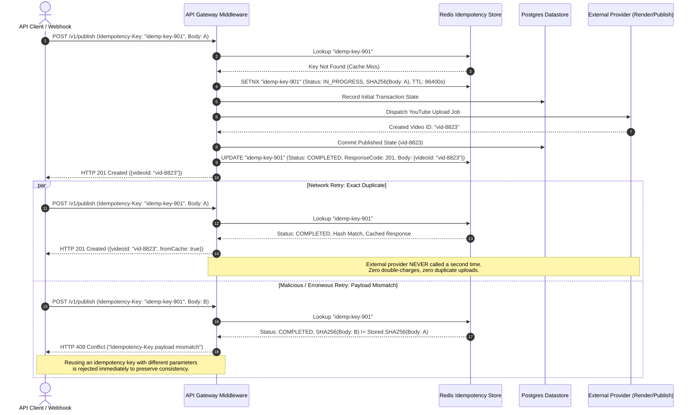
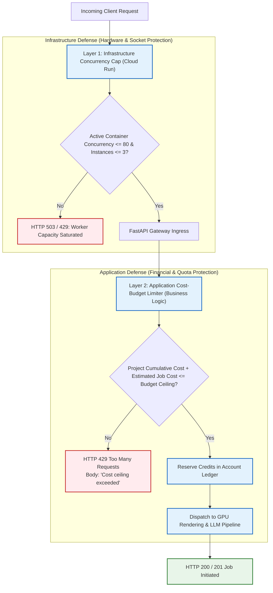
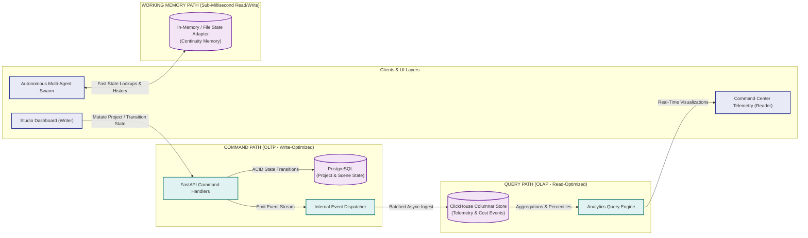
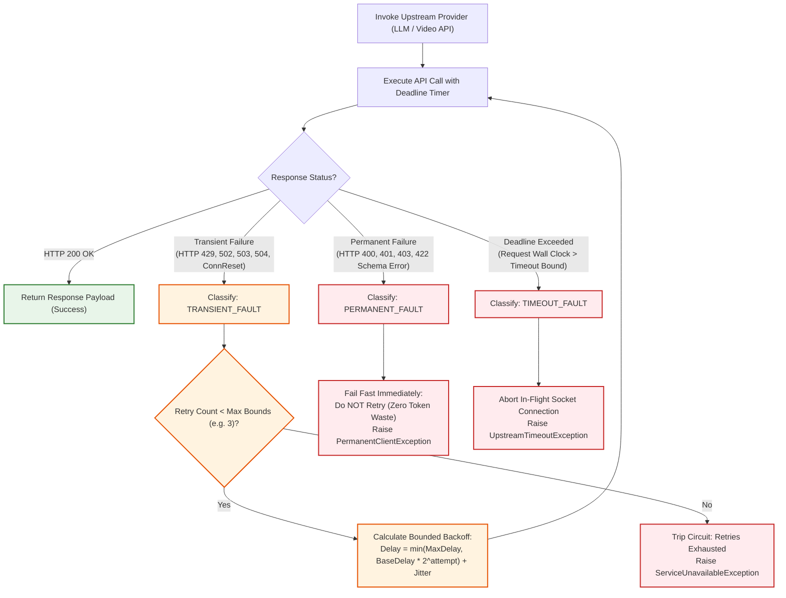

# System Design Deep-Dive: Production Patterns Grounded in Real Code

This document details five core distributed system design patterns implemented, tested, and verified in production across this platform. Rather than presenting abstract textbook architectures, every diagram maps directly to concrete backend services, finite-state machines, database engines, and automated test fixtures in this repository.

---

## Table of Contents
1. [Saga Pattern: Distributed Workflow Orchestration with Halt-on-Failure](#1-saga-pattern-distributed-workflow-orchestration-with-halt-on-failure)
2. [Idempotency Keys: Exactly-Once Semantics for Cost-Bearing Operations](#2-idempotency-keys-exactly-once-semantics-for-cost-bearing-operations)
3. [Defense-in-Depth Rate Limiting: Cost-Budget Ceilings & Concurrency Caps](#3-defense-in-depth-rate-limiting-cost-budget-ceilings--concurrency-caps)
4. [CQRS & Polyglot Persistence: Specialized OLTP, OLAP, and Working Memory](#4-cqrs--polyglot-persistence-specialized-oltp-olap-and-working-memory)
5. [Circuit Breaker & Three-Way Fault Classification with Bounded Backoff](#5-circuit-breaker--three-way-fault-classification-with-bounded-backoff)

---

### 1. Saga Pattern: Distributed Workflow Orchestration with Halt-on-Failure

#### Interview Concept
Distributed transactions, the Saga pattern (orchestration vs. choreography), and compensating actions vs. halt-on-failure workflow semantics.

#### Grounded In
- **Orchestrator & State Machine:** 12-state project lifecycle FSM (`project.py`) and multi-agent workflow controller (`orchestrator_agent.py`).
- **Publishing Guardrails:** 8 automated verification gates (`publishing_gate_service.py`).
- **Verified Invariant Tests:** `test_governance_block_halts_publishing` (verifies HTTP 422 halt on IBM Policy violation) and `test_cost_ceiling_stops_render_pipeline` (verifies HTTP 429 budget halt).

#### Architecture & Workflow Execution
The platform coordinates heterogeneous distributed services (LLM text synthesis, IBM AI Governance evaluation, GPU video rendering, FFmpeg composition, and YouTube Data API publishing) through an **orchestrated saga**. Rather than executing blind compensating rollbacks (which would delete generated assets and waste paid API calls), the orchestrator enforces **halt-on-failure semantics**: failed validation halts forward progress, preserves intermediate artifacts in Postgres for inspection, and alerts human operators for remediation.

```mermaid
sequenceDiagram
    autonumber
    actor User as Client / User
    participant Orch as Orchestrator FSM (project.py)
    participant LLM as LLM Provider (Gemini 2.5)
    participant Gov as Governance Gate (IBM Guardrails)
    participant Cost as Cost Budget Service
    participant Render as GPU Video Renderer
    participant FFmpeg as FFmpeg Post-Processor
    participant YT as YouTube API Gateway

    User->>Orch: Start Generation Job (CREATED)
    Orch->>Orch: Transition: GENERATING_SCRIPT
    Orch->>LLM: Generate Scene Breakdown & Voiceover
    LLM-->>Orch: Script & Prompt Payloads

    Orch->>Orch: Transition: VALIDATING_GOVERNANCE
    Orch->>Gov: Evaluate Content Compliance & Safety
    alt Governance Violation Detected (e.g., PII / Disallowed Claims)
        Gov-->>Orch: Flagged Violation (HTTP 422 Policy Error)
        Orch->>Orch: Transition: HALTED_GOVERNANCE_BLOCKED
        Note over Orch,Gov: Halt-on-Failure: Forward progress stopped.<br/>Script preserved for human audit; no rollback needed.
        Orch-->>User: Halt Notification with Remediation Checklist
    else Governance Policy Passed
        Gov-->>Orch: Policy Clearance Token (8/8 Gates Validated)
        Orch->>Orch: Transition: BUDGETING
        Orch->>Cost: Reserve Token & Compute Credits
        alt Budget Exceeded
            Cost-->>Orch: Limit Reached (HTTP 429 Cost Ceiling)
            Orch->>Orch: Transition: HALTED_BUDGET_EXCEEDED
            Orch-->>User: 429 Cost Ceiling Exceeded
        else Budget Allocated
            Cost-->>Orch: Credit Locked
            Orch->>Orch: Transition: RENDERING_SCENES
            Orch->>Render: Dispatch Video Gen Batches
            Render-->>Orch: Raw Video Chunks
            Orch->>Orch: Transition: COMPOSITING
            Orch->>FFmpeg: Concatenate & Normalize Audio/Video
            FFmpeg-->>Orch: Final Encoded MP4
            Orch->>Orch: Transition: PUBLISHING
            Orch->>YT: Upload & Publish Video
            YT-->>Orch: Video ID & Published URL
            Orch->>Orch: Transition: PUBLISHED
            Orch-->>User: Job Complete (Published URL)
        end
    end
```

#### Why This Matters for System Design
Standard textbook answers to distributed transactions reflexively propose two-phase commit (2PC) across microservices or full compensating rollbacks (e.g., deleting orders and sending undo emails). In automated generative workflows, calling external, cost-bearing APIs (LLM tokens, video generation compute) makes backward compensation wasteful. Demonstrating an **orchestrated saga with explicit forward-gating and terminal halt states** proves an understanding of domain-appropriate transaction boundaries, audit-trail retention, and cost control.

---

### 2. Idempotency Keys: Exactly-Once Semantics for Cost-Bearing Operations

#### Interview Concept
Idempotency keys, distributed request deduplication, replay caches, at-least-once network delivery vs. exactly-once application execution, and payload mutation collision handling.

#### Grounded In
- **Route Handlers:** HTTP `Idempotency-Key` header middleware on integration, scene generation, and publishing routes.
- **Deduplication Engine:** In-flight lock state and persistent execution cache with SHA-256 payload fingerprinting.
- **Verified Invariant Tests:**
  - `test_approval_replay_is_idempotent`: Re-sending approval with the same key returns identical results without duplicate triggers.
  - `test_integration_create_is_idempotent_and_emits_audit_event`: Ensures idempotency cache hits emit deduplication audit logs without duplicate records.
  - Production webhook callback idempotency bindings.

#### Request Replay & Conflict Resolution Lifecycle



#### Why This Matters for System Design
Distributed clients inevitably retry requests due to network timeouts, dropped TCP packets, or user double-clicks. In payment systems or GPU video rendering, non-idempotent endpoints cause catastrophic financial double-charges and duplicated external state. Implementing **idempotency keys with request body hashing, atomic in-flight locking, and cached response short-circuiting** demonstrates real-world production API rigor.

---

### 3. Defense-in-Depth Rate Limiting: Cost-Budget Ceilings & Concurrency Caps

#### Interview Concept
Multi-tier rate limiting, token bucket algorithms, financial backpressure, graceful degradation under load, and separating infrastructure concurrency protection from business budget caps.

#### Grounded In
- **App-Level Budget Guardrail:** Real-time cost-tracker and token quota service (`cost_tracker.py`), returning explicit HTTP 429 `"Cost ceiling exceeded"`.
- **Infra-Level Concurrency Throttle:** Cloud Run autoscaling configuration (`min-instances=0`, `max-instances=3`, `concurrency=80`).
- **Verified Invariant Tests:** Auto-Pilot cost-ceiling enforcement test returning HTTP 429 when estimated scene render cost exceeds configured project ceiling.

#### Two-Layer Defense Architecture



#### Why This Matters for System Design
When asked to "design a rate limiter," most engineers only describe an algorithmic counter (sliding window or token bucket) checking requests per minute. In enterprise AI systems, **request frequency is decoupled from resource consumption**: 1 request generating 5 minutes of high-resolution video costs orders of magnitude more than 100 metadata lookups. Layering an **infrastructure-level concurrency throttle** (preventing memory exhaustion) with an **application-level monetary budget limiter** (preventing cloud billing spikes) represents true defense-in-depth.

---

### 4. CQRS & Polyglot Persistence: Specialized OLTP, OLAP, and Working Memory

#### Interview Concept
CQRS (Command Query Responsibility Segregation), polyglot persistence, transactional consistency vs. analytical query optimization, and hot working memory vs. cold durable storage.

#### Grounded In
- **OLTP Write Model:** PostgreSQL datastore backing the 12-state FSM (`project.py`, `scene.py`) with serializable transaction isolation.
- **OLAP Analytical Read Model:** ClickHouse columnar database ingesting raw event telemetry and serving sub-second aggregation queries for the Studio Command Center dashboard (`clickhouse_analytics.py`).
- **Agent Continuity Memory:** Ephemeral, high-throughput in-memory state adapter for multi-agent conversational context (`governance_agent.py`, `orchestrator_agent.py`).

#### Architecture Flow



#### Why This Matters for System Design
A single monolithic database cannot simultaneously optimize for high-frequency ACID writes, multi-million-row analytical aggregations, and sub-millisecond agent memory retrieval. Attempting to run analytical rollups on PostgreSQL during active video rendering degrades transactional throughput. Implementing **polyglot persistence with CQRS** ensures each access pattern uses the correct underlying storage engine:
- **Postgres** provides relational guarantees and strict ACID state transitions.
- **ClickHouse** provides columnar vectorization for instant percentile and cost aggregations.
- **Working Memory** allows agents to iterate without database I/O latency.

---

### 5. Circuit Breaker & Three-Way Fault Classification with Bounded Backoff

#### Interview Concept
Circuit breaker pattern, exponential backoff with decorrelated jitter, timeout enforcement, and semantic error classification (transient vs. permanent vs. timeout).

#### Grounded In
- **Reliability Wrapper:** `RetryingLLMProvider` in `backend/app/providers/reliability.py`.
- **Verified Invariant Tests:**
  - `test_retrying_provider_retries_transient_failures_with_a_bound`: Retries transient 429/503 errors up to maximum configured bound, then halts.
  - `test_retrying_provider_enforces_timeout`: Hard timeout interruption prevents indefinite socket hangs.
  - `test_retrying_provider_classifies_permanent_failures`: Immediately fails fast on permanent 400/401/422 errors without wasting retries.

#### Fault Classification & Execution State Diagram



#### Why This Matters for System Design
Naively retrying all failed API calls ("just retry 3 times") creates catastrophic **retry storms**, DDoS-ing already degraded upstream dependencies and burning compute quota retrying malformed requests that can never succeed. A production-grade distributed client must implement **semantic three-way failure classification**:
1. **Transient failures** (rate limits, upstream blips) recover with bounded exponential backoff and jitter.
2. **Permanent failures** (authentication errors, validation failures) fail fast immediately to conserve budget.
3. **Timeouts** are bounded by strict client-side cancellation tokens to prevent cascading worker starvation.
