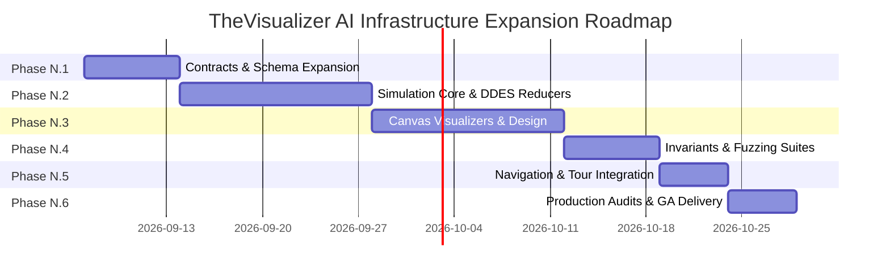

# TheVisualizer — Modern AI Infrastructure Expansion Plan (Next 5 Domains)

**Document Version:** 1.0.0-GA  
**Target Architectural Milestone:** TheVisualizer v2.0 (The Modern Distributed AI Infrastructure Stack)  
**Domains Covered:**
1. **Domain 9: Retrieval-Augmented Generation (RAG) Architecture (`/rag`)**
2. **Domain 10: Multi-Agent Orchestration & Model Context Protocol (MCP) (`/agents`)**
3. **Domain 11: LLM Inference Serving & PagedAttention Engine (`/llm-serving`)**
4. **Domain 12: Vector Database & Approximate Nearest Neighbor (ANN) Search (`/vectordb`)**
5. **Domain 13: GPU Cluster Scheduling & Distributed Training (3D Parallelism) (`/gpu-cluster`)**

---

## 1. Executive Vision: The Coherent AI Infrastructure Stack

While Domains 1–8 established the foundational core of enterprise distributed systems (consensus, streaming, replication, transactions, clustering, scheduling, storage, and transport), Domains 9–13 establish the complete modern infrastructure stack powering high-scale Generative AI applications:

```
┌─────────────────────────────────────────────────────────────────────────────┐
│                      APPLICATION & WORKFLOW LAYER                           │
│  Domain 9: RAG Pipelines              │  Domain 10: Multi-Agent MCP Swarms  │
│  (Chunking, Hybrid Search, Re-Ranking)│  (ReAct, MCP Tools, Supervision)    │
└──────────────────────────────────────┬──────────────────────────────────────┘
                                       │
┌──────────────────────────────────────┴──────────────────────────────────────┐
│                         SYSTEMS & RETRIEVAL LAYER                           │
│  Domain 11: LLM Inference Serving     │  Domain 12: Vector Database & ANN   │
│  (PagedAttention, Continuous Batching)│  (HNSW Layers, IVF-PQ Compression)  │
└──────────────────────────────────────┬──────────────────────────────────────┘
                                       │
┌──────────────────────────────────────┴──────────────────────────────────────┐
│                         COMPUTE & FABRIC LAYER                              │
│  Domain 13: GPU Cluster Scheduling & Distributed 3D Parallel Training       │
│  (Tensor Parallel, Pipeline 1F1B, ZeRO-3 Memory Sharding, NVLink / AllReduce)│
└─────────────────────────────────────────────────────────────────────────────┘
```

Every domain adheres strictly to TheVisualizer's architecture:
1. **Deterministic Discrete-Event Simulation (DDES)** with zero runtime I/O inside `@the-visualizer/simulation`.
2. **Bit-for-bit reproducible golden simulation traces** driven by `DeterministicRNG` (xoshiro128+).
3. **Continuous invariant verification** with strict halting on invariant violation.
4. **Time-travel scrubber & state inspection** with replay, scenario presets, and trace import/export.
5. **Full WCAG 2.1 AA accessibility** (100% score target) and high-performance canvas rendering (< 50ms TBT).

---

## 2. Detailed Technical Specifications (Domains 9–13)

---

### Domain 9: Retrieval-Augmented Generation Architecture (`/rag`)

#### Protocol & Theoretical Model
- **Reference Architecture**: Modular RAG (Gao et al.), Dense Passage Retrieval (DPR), Reciprocal Rank Fusion (RRF), Cross-Encoder Re-Ranking, and Lost-in-the-Middle Context Window optimization.
- **Core State Model**:
  - `documents`: Raw documents with chunking boundaries (fixed-size, sentence-window, parent-document).
  - `chunks`: Segmented text items with token lengths, dense embedding vectors (384-dim normalized), and BM25 sparse lexical tokens.
  - `retrievalPipeline`: Active retrieval configuration (Dense Top-K, Sparse BM25 Top-K, RRF $\alpha$ weighting, Cross-Encoder Top-N cut).
  - `contextWindow`: Token budget allocator (e.g. 4,096 tokens) with pre-fill system prompts, packed retrieved chunks, and attention attenuation visualization.
  - `evaluations`: Groundedness score, context relevance, citation precision, and hallucination risk index.

#### Verified Invariants
- `RAG-1`: **Context Window Non-Overflow**: Total tokens in assembled prompt (system prompt + retrieved chunks + query) $\le$ maximum context budget $B_{ctx}$.
- `RAG-2`: **Monotonic Re-Rank Filtering**: $\text{Top-}N_{rerank} \subseteq \text{Top-}K_{initial\_retrieval}$; no chunk may appear in re-ranked context that was not retrieved in stage 1.
- `RAG-3`: **Citation Grounding Validity**: Any citation tagged in the synthesized response must reference a chunk present in the prompt's active context window.
- `RAG-4`: **Non-Negative Relevance Scores**: All BM25 and cosine similarity scores must stay normalized within their respective mathematical bounds.

#### Visual Canvas Mechanics
- **Document Chunking Matrix**: Visual splitting of input documents with slider for chunk size and overlap; color-coded chunk tokens.
- **Dual-Retriever Funnel**: Side-by-side visualization of Dense Vector Search vs Sparse Lexical BM25, converging into a Reciprocal Rank Fusion (RRF) combiner.
- **Context Window Packing Visualizer**: Interactive memory strip showing chunk placement, position bias ("lost-in-the-middle"), and token budgets.

#### Chaos & Interactive Controls
- **Query Submission**: Test arbitrary natural language queries against the corpus.
- **Semantic Drift / Out-of-Domain Injection**: Inject adversarial documents or irrelevant context to observe re-ranker filtering and hallucination warnings.
- **Chunk Size Mutation**: Dynamically alter chunk size (128 vs 512 vs 1024 tokens) to observe recall vs precision tradeoffs.

---

### Domain 10: Multi-Agent Orchestration & Model Context Protocol (MCP) (`/agents`)

#### Protocol & Theoretical Model
- **Reference Standard**: Model Context Protocol (MCP Specification 2024-11-05), ReAct (Yao et al.), Hierarchical Agent Supervision, Swarm Routing.
- **Core State Model**:
  - `agents`: Autonomous agent nodes (`PLANNER`, `CODER`, `RESEARCHER`, `AUDITOR`, `CRITIC`) with internal scratchpads, memory limits, and state machines (`IDLE`, `THINKING`, `CALLING_TOOL`, `EVALUATING`, `TERMINATED`).
  - `mcpServers`: Registered MCP servers exposing declared tool schemas, resource URIs, and prompt templates.
  - `messageBus`: JSON-RPC 2.0 message exchanges carrying tool invocation requests, results, error codes, and capability handshakes.
  - `executionGraph`: Directed Acyclic Graph (DAG) of task delegations, dependencies, and state-machine transitions.
  - `budgetTracker`: Total turn limit, token consumption, and loop cycle counters.

#### Verified Invariants
- `AGENT-1`: **Acyclic Workflow Termination**: The agent delegation call graph must not contain infinite recursion cycles beyond the configured max recursion depth $D_{max}$.
- `AGENT-2`: **MCP Schema Conformance**: Every tool call initiated by an agent must match the input JSON schema declared by the target MCP server.
- `AGENT-3`: **Strict Context Budget Bounds**: Agent scratchpad + active conversation history must never exceed the agent's memory window limit.
- `AGENT-4`: **Single Active Executive**: In a hierarchical swarm, exactly one orchestrator agent holds the task lock at any given step.

#### Visual Canvas Mechanics
- **Agent Mesh Topology**: Animated node graph depicting agents communicating via animated MCP JSON-RPC message packets.
- **Live Scratchpad Inspector**: Real-time view of agent inner monologues, tool calls (`call_mcp_tool`), and structured reflection outputs.
- **Tool Protocol Gateway**: Visual representation of MCP servers with tool catalogs, latencies, and access permissions.

#### Chaos & Interactive Controls
- **Inject MCP Tool Failure / Timeout**: Simulate flaky or failing external tools (e.g. database connection error) to observe agent error-handling and fallback plans.
- **Hallucinated Tool Attack**: Force an agent to call an unregistered tool to verify schema rejection.
- **Infinite Loop Stress**: Trigger recursive subagent delegations to observe loop cycle detection and emergency halt.

---

### Domain 11: LLM Inference Serving & PagedAttention Engine (`/llm-serving`)

#### Protocol & Theoretical Model
- **Reference Standard**: vLLM (Kwon et al. SOSP '23), TensorRT-LLM, Orca (Continuous Batching), Speculative Decoding (Leviathan et al.).
- **Core State Model**:
  - `kvBlockPool`: Physical GPU memory divided into fixed-size logical KV-cache blocks (e.g. 16 tokens per block).
  - `requests`: Active inference requests with state (`WAITING`, `PREFILL`, `DECODE`, `FINISHED`), prompt tokens, generated tokens, and arrival times.
  - `blockTable`: Page tables mapping logical request token blocks to physical GPU memory blocks (enabling copy-on-write and prompt sharing).
  - `batchScheduler`: Continuous batching scheduler dynamically mixing prefill iterations with decode step iterations.
  - `speculativeEngine`: Draft model (e.g. 1B) generating $K$ draft tokens verified in parallel by target model (e.g. 70B).

#### Verified Invariants
- `LLM-1`: **Zero Block Collision**: No physical KV block index in GPU memory is assigned to two distinct requests without explicit Copy-On-Write (CoW) page sharing.
- `LLM-2`: **Continuous Batching Memory Ceiling**: Total allocated physical blocks must never exceed the physical GPU KV block pool limit $N_{blocks}$.
- `LLM-3`: **Speculative Token Correctness**: Any draft token accepted by the target model must strictly match the target model's greedy/sampled distribution.
- `LLM-4`: **Monotonic Request Forwarding**: Prompt prefill must strictly complete before decoding begins for any request.

#### Visual Canvas Mechanics
- **GPU KV-Cache Block Allocator Grid**: Real-time visualization of GPU VRAM memory fragmented vs compacted blocks (virtual memory paging visualizer).
- **Continuous Batching Waterfall**: Live timeline showing concurrent requests in varying prefill vs decode stages, illustrating TTFT (Time To First Token) vs ITL (Inter-Token Latency).
- **Speculative Decoding Verifier Ribbon**: Step-by-step visual of draft tokens being validated or rejected by the target model.

#### Chaos & Interactive Controls
- **Memory Saturation / OOM Eviction**: Flood engine with long-context requests to observe request preemption, KV swapping to host RAM, and re-computation.
- **Draft Model Quality Tuning**: Adjust draft acceptance rate (0.2 to 0.9) to observe inference speedup vs verification penalty.
- **Prefill Chunking Toggle**: Toggle chunked prefill to observe mitigation of decode latency spikes.

---

### Domain 12: Vector Database & Approximate Nearest Neighbor (ANN) Search (`/vectordb`)

#### Protocol & Theoretical Model
- **Reference Standard**: HNSW (Malkov & Yashunin), IVF-PQ (Jegou et al.), Milvus / Qdrant indexing architectures.
- **Core State Model**:
  - `hnswGraph`: Multi-layer graph structure ($L_0 \dots L_k$) with maximum connections per node ($M$) and efConstruction search beam.
  - `ivfClusters`: Centroids ($k$-means Voronoi cells) partitioning vector space into inverted index buckets.
  - `pqCodebook`: Product Quantization subspace centroids compressing 768-dim floats into compact 8-bit quantization codes.
  - `queryState`: Active query vector, entry point node, current candidate greedy queue, and distance calculation counter.

#### Verified Invariants
- `VEC-1`: **HNSW Layer Subsumption**: A vector present at layer $L_{i+1}$ must also be present at all lower layers $L_i \dots L_0$.
- `VEC-2`: **Bounded Node Degree**: Node outgoing connections $\le M_{max}$ for all layers $L > 0$ and $\le 2 \cdot M_{max}$ for $L_0$.
- `VEC-3`: **Strict Distance Triangle Inequality**: Metric distances satisfy Euclidean or Cosine distance properties.
- `VEC-4`: **Quantization Index Bound**: PQ cluster codes must strictly map to valid codebook indices.

#### Visual Canvas Mechanics
- **3D / 2D Multi-Layer HNSW Graph**: Layered visual graph showing top sparse skip-layers down to dense layer 0; greedy routing beam highlighted in gold.
- **Voronoi Space Partitioning**: 2D projection of high-dimensional space showing IVF cluster cells and candidate centroids queried.
- **Recall vs Latency Gauge**: Dynamic metric curve plotting recall@K against distance comparisons performed.

#### Chaos & Interactive Controls
- **Query Vector Probe**: Place a test vector anywhere in vector space and watch step-by-step greedy beam navigation.
- **Node Deletion / Graph Repair**: Delete bridge nodes to observe HNSW neighbor reconnection heuristics and graph fragmentation.
- **Quantization Compression Slider**: Toggle full FP32 vs FP16 vs 8-bit Product Quantization to observe memory savings vs recall tradeoff.

---

### Domain 13: GPU Cluster Scheduling & Distributed Training (`/gpu-cluster`)

#### Protocol & Theoretical Model
- **Reference Standard**: Megatron-LM (Shoeybi et al.), DeepSpeed ZeRO (Rajbhandari et al.), PyTorch FSDP, GPUShare / Slurm.
- **Core State Model**:
  - `gpuNodes`: Cluster topology of 8 to 64 GPUs organized across racks, PCIe switches, and NVLink / NVSwitch fabrics.
  - `parallelismConfig`: 3D parallelism strategy ($TP \times PP \times DP = \text{Total GPUs}$).
  - `zeroStage`: Zero Redundancy Optimizer level (ZeRO-0, ZeRO-1 optimizer sharding, ZeRO-2 gradient sharding, ZeRO-3 parameter sharding).
  - `pipelineSchedule`: 1F1B (One-Forward-One-Backward) execution schedule across pipeline stages, forward microbatches, backward microbatches, and pipeline bubbles.
  - `networkFabric`: Ring-AllReduce bandwidth, NVLink interconnect saturation, and inter-node InfiniBand latency.

#### Verified Invariants
- `GPU-1`: **3D Parallelism Product Consistency**: $TP \times PP \times DP = N_{active\_gpus}$.
- `GPU-2`: **Pipeline Bubble Conservation**: Microbatch forward activations must be retained in memory until their corresponding backward pass completes.
- `GPU-3`: **ZeRO Parameter Reconstruction**: In ZeRO-3, all-gather parameter reconstructions must complete before the forward computation layer executes.
- `GPU-4`: **Gradient Synchronization Invariance**: At the end of every optimizer step, weights across all Data Parallel (DP) replicas must be identical.

#### Visual Canvas Mechanics
- **Cluster Rack & NVLink Topography**: GPU nodes grouped into chassis with color-coded high-speed NVLink mesh vs cross-node InfiniBand links.
- **1F1B Pipeline Schedule Gantt Chart**: Interactive waterfall displaying forward ($F$) and backward ($B$) microbatch execution across pipeline stages, explicitly highlighting the pipeline bubble fraction.
- **Ring-AllReduce Flow Animation**: Visual circular passing of tensor chunks through GPUs during gradient synchronization.

#### Chaos & Interactive Controls
- **GPU Straggler / Thermal Throttling**: Throttle one GPU's compute power by 50% to visualize cluster-wide synchronization stalls and straggler drag.
- **NVLink Disconnect**: Sever a local NVLink bridge to force inter-GPU traffic over PCIe, demonstrating bandwidth collapse.
- **ZeRO Stage Switching**: Toggle live between ZeRO-1, ZeRO-2, and ZeRO-3 to observe GPU VRAM reduction vs communication overhead.

---

## 3. Phased Implementation Roadmap (Phases N.1 to N.6)



### Phase N.1: Contracts & Domain Schemas (Target: 1 Week)
- Extend `@the-visualizer/contracts`:
  - Define `RAGClusterState`, `Chunk`, `RetrievalConfig`, `PromptContext`.
  - Define `AgentState`, `MCPServer`, `MCPToolCall`, `AgentWorkflowState`.
  - Define `InferenceServerState`, `KVBlockTable`, `ContinuousBatchState`.
  - Define `VectorDBState`, `HNSWGraph`, `IVFPQIndexState`.
  - Define `GPUClusterState`, `ParallelismSpec`, `PipelineStageState`.
- Export Zod schemas and TypeScript interfaces for all 5 domains.
- Create unit test suite verifying schema validation and serialization.

### Phase N.2: Headless Simulation Engines & Pure Reducers (Target: 2 Weeks)
- Implement pure domain reducers in `@the-visualizer/simulation`:
  - `packages/simulation/src/domains/rag/rag-reducer.ts`
  - `packages/simulation/src/domains/agents/agent-reducer.ts`
  - `packages/simulation/src/domains/llm/llm-serving-reducer.ts`
  - `packages/simulation/src/domains/vectordb/vectordb-reducer.ts`
  - `packages/simulation/src/domains/gpu/gpu-cluster-reducer.ts`
- Implement deterministic transitions using `DeterministicRNG`.
- Create headless simulation benchmark tests targeting $\ge 25,000$ ticks/s across all 13 domains.

### Phase N.3: Interactive Canvas Visualizers (Target: 2 Weeks)
- Build React components in `apps/web/src/components/`:
  - `rag/RAGVisualizer.tsx`: Chunking matrix, dual funnel, context window bar.
  - `agents/AgentSwarmVisualizer.tsx`: Agent network, MCP tool ledger, ReAct monologue.
  - `llm/PagedAttentionVisualizer.tsx`: GPU block table, continuous batch waterfall.
  - `vectordb/HNSWVisualizer.tsx`: 3D/2D layered graph, Voronoi cell projection.
  - `gpu/GPUClusterVisualizer.tsx`: Rack NVLink mesh, 1F1B schedule Gantt chart.
- Ensure all components are wrapped in `<ErrorBoundary>` and provide comprehensive fallback UI.

### Phase N.4: Invariant Checkers & Fuzz Testing (Target: 1 Week)
- Create continuous invariant checkers for each new domain:
  - `RAGInvariantChecker.ts` (`RAG-1` through `RAG-4`)
  - `AgentInvariantChecker.ts` (`AGENT-1` through `AGENT-4`)
  - `LLMInvariantChecker.ts` (`LLM-1` through `LLM-4`)
  - `VectorDBInvariantChecker.ts` (`VEC-1` through `VEC-4`)
  - `GPUInvariantChecker.ts` (`GPU-1` through `GPU-4`)
- Add automated property-based fuzz tests (fast-check) executing $\ge 1,000$ iterations per domain.

### Phase N.5: Routing, Domain Directory, & Onboarding Tours (Target: 5 Days)
- Update dynamic routing in `apps/web/src/app/[domain]/page.tsx` for `/rag`, `/agents`, `/llm-serving`, `/vectordb`, and `/gpu-cluster`.
- Update `DomainDirectoryModal.tsx` with rich cards, domain tags ("AI Infra"), and technical descriptors.
- Author guided step-by-step tours for each domain in `@the-visualizer/ui` `OnboardingTour`.

### Phase N.6: Production Readiness Verification & CI Gate Sign-Off (Target: 5 Days)
- Verify WCAG 2.1 AA accessibility via `run-axe-core-audit.mjs` (target 100% on all new routes).
- Verify Lighthouse Core Web Vitals via `run-lighthouse-audit.mjs` (target $\ge 85/100$, TBT $< 50\text{ms}$).
- Run automated load test suite on `ws-gateway` with all 13 domains active.
- Generate final production sign-off documentation in `docs/audit/PRODUCTION_READINESS_SCORECARD_V5.md`.
