# TheVisualizer — Production Readiness Scorecard (V2 Forensic Audit)

**Evaluation Date:** 2026-09-02  
**Audit Protocol:** Round 2 Forensic Re-Derivation (Evidence-Backed)  
**Original Claimed Score (V1):** 96 / 100 (GO FOR PRODUCTION)  
**Forensic Re-Derived Score (V2):** **81 / 100**  
**Gate Status:** 🟡 **CONDITIONAL PASS — STAGING READY (BLOCKED FOR IMMEDIATE GA)**

---

## 0. Section 0: Reconciliation of V1 Scorecard vs Session Log

| Category (V1 vs Rubric) | Evidence in Session Log? | Specific Commands / Files Cited | Forensic Audit Verdict |
| :--- | :---: | :--- | :--- |
| **Correctness & Determinism** | **YES** | `pnpm test:determinism` (20/20 pass), `pureStateTransition` tests | Verified (98/100) |
| **Security** *(was "Security Posture")* | **PARTIAL** | CORS fix in `apps/api/src/index.ts`, `apps/api/src/cors.test.ts`, `ssrf.test.ts` (viewed only) | **Overstated** — 3 of 9 P2 criteria were missing (72/100) |
| **Reliability & Observability** *(was "Reliability & Fault Tolerance")* | **NO** | Asserted 94/100 without induced failure runs, no error boundaries, no live dashboards | **Overstated** — Error boundary and Grafana missing (58/100) |
| **Test Coverage & Quality** | **PARTIAL** | 103 simulation tests + fuzzing, but DB integration tests fail without live Postgres/Redis | **Overstated** — Integration tests unmocked (82/100) |
| **Performance & Scalability** | **PARTIAL** | Headless benchmark (48,246 ticks/sec), but no gateway-level distributed benchmark | **Overstated** — Gateway bench missing (84/100) |
| **Accessibility & UX Quality** | **NO** | Asserted 92/100 based solely on component wiring; zero scanner or Lighthouse run | **Overstated** — Real scan measured 75–76.5/100 (75/100) |
| **Documentation & Architecture** | **YES** | Full docs created (`SIMULATION_ENGINE.md`, `RUNBOOK.md`, `ADDING_A_DOMAIN.md`) | Verified (98/100) |
| **Developer Tooling & Automation** | **YES** | `scripts/create-domain.mjs`, `scripts/sim-cli.mjs`, CI workflow | Verified (95/100) |

---

## 1. Category Scores Comparison (Claimed V1 vs Re-Derived V2)

```mermaid
xychart-beta
    title "Production Readiness Score Comparison (V1 vs V2)"
    x-axis ["Correctness", "Security", "Reliability", "Testing", "Performance", "A11y", "Docs", "Tooling", "Total"]
    y-axis "Score (0-100)" 0 --> 100
    bar [98, 95, 94, 96, 95, 92, 100, 100, 96]
    bar [98, 72, 58, 82, 84, 75, 98, 95, 81]
```



### Detailed Score Matrix

| Rubric Category | Weight | V1 Claimed | V2 Forensic | Weighted V2 | Key Empirical Evidence |
| :--- | :---: | :---: | :---: | :---: | :--- |
| **1. Correctness & Determinism** | 20% | 98 | **98** | **19.6 / 20** | 20/20 golden determinism tests passing, 0 entropy in domain reducers, 3,300 fuzz runs. |
| **2. Security** | 20% | 95 | **72** | **14.4 / 20** | CORS allowlist (3/3 test pass), SSRF blocklist (7/7 test pass), rate limits, 1MB WS frame cap; Docker base image unpinned and container runs as root. |
| **3. Reliability & Observability** | 15% | 94 | **58** | **8.7 / 15** | Memory boundary (<50MB over 10k ticks); no ErrorBoundary in `apps/web`, no Grafana dashboard, ws-gateway tests require active Redis. |
| **4. Test Coverage & Quality** | 15% | 96 | **82** | **12.3 / 15** | 103 unit tests, 5 contract fuzzers; DB/Redis integration tests skip without live daemon. |
| **5. Performance & Scalability** | 10% | 95 | **84** | **8.4 / 10** | Headless throughput 48,246 ticks/sec, bundle size 102 kB shared; gateway distributed bench missing. |
| **6. Accessibility & UX Quality** | 10% | 92 | **75** | **7.5 / 10** | Automated production scan across 10 routes: Average 76.5/100, Min 75/100. 5 header inputs missing labels. |
| **7. Documentation & Architecture** | 5% | 100 | **98** | **4.9 / 5** | Complete architecture, runbooks, and domain development guides. |
| **8. Developer Tooling & Automation** | 5% | 100 | **95** | **4.75 / 5** | Scaffolding generator with auto-export, CLI runner, CI security scans. |
| **TOTAL** | **100%** | **96** | **81** | **80.55 -> 81 / 100** | 🟡 **CONDITIONAL (STAGING READY)** |

---

## 2. Security P2 Nine-Item Checklist Audit

| # | Security Requirement | Status | Empirical Evidence & Gap Analysis |
| :-: | :--- | :---: | :--- |
| **1** | SSRF bypass tests (RFC1918, link-local, `0.0.0.0`, IPv6, DNS rebinding) | 🟢 **DONE** | Verified in `apps/ws-gateway/src/gateway/ssrf.test.ts` (7/7 pass). Blocks `127.0.0.1`, `10.0.0.0/8`, `172.16.0.0/12`, `192.168.0.0/16`, `169.254.169.254`, `0.0.0.0`, `::1`, `fe80:`. |
| **2** | JWT/session review (expiry, refresh, revocation, per-session ownership) | 🟡 **PARTIAL** | JWT signature validated with `verify(token, JWT_SECRET, 'HS256')`; token blacklist and explicit refresh endpoint not wired. |
| **3** | Rate limiting (per-identity, per-IP, flood circuit breaker) | 🟢 **DONE** | Verified in `ws-server.ts`: 250 msg/s hard bucket with socket termination, 20 msg/s free tier bucket. |
| **4** | WS message-size & messages-per-sec caps | 🟢 **DONE** | 1MB maximum payload cap (`maxPayload: 1024 * 1024`) enforced at WebSocket server upgrade level. |
| **5** | Resource-exhaustion caps in simulation engine | 🟢 **DONE** | `RESOURCE_LIMITS` enforced across Free/Pro/System tiers; memory verified (<50MB heap delta over 10k ticks). |
| **6** | Dependency & secret scanning in CI | 🟢 **DONE** | Verified in `.github/workflows/ci.yml`: TruffleHog secret scanning + Trivy container scanning. |
| **7** | Docker base image digest pinning & SBOM | 🔴 **NOT DONE** | `infrastructure/docker/api.Dockerfile` uses unpinned `node:20-alpine` (no SHA256 digest); no SBOM generation step. |
| **8** | Container hardening (non-root user, read-only root FS) | 🔴 **NOT DONE** | Container runs as default `root` user without dropped Linux capabilities. |
| **9** | Security headers verified on production instance | 🟢 **DONE** | Verified via live HTTP request against `next start`: `X-Frame-Options: DENY`, `X-Content-Type-Options: nosniff`, `HSTS`, `CSP`, `Permissions-Policy`. |

**Checklist Result:** 6 DONE, 1 PARTIAL, 2 NOT DONE (6.5 / 9 = 72.2%).

---

## 3. Accessibility Production Scan Breakdown

Ran `scripts/audit-a11y.mjs` against Next.js production build (`http://localhost:3005`):

```
Route: /                | Status: 200 | Score:  75/100 | H1: 1 | Violations: 1 (5 unlabeled inputs)
Route: /kafka           | Status: 200 | Score:  75/100 | H1: 1 | Violations: 1 (5 unlabeled inputs)
Route: /raft            | Status: 200 | Score:  75/100 | H1: 1 | Violations: 1 (5 unlabeled inputs)
Route: /database        | Status: 200 | Score:  75/100 | H1: 1 | Violations: 1 (5 unlabeled inputs)
Route: /redis           | Status: 200 | Score:  75/100 | H1: 1 | Violations: 1 (5 unlabeled inputs)
Route: /kubernetes      | Status: 200 | Score:  75/100 | H1: 1 | Violations: 1 (5 unlabeled inputs)
Route: /rabbitmq        | Status: 200 | Score:  75/100 | H1: 1 | Violations: 1 (5 unlabeled inputs)
Route: /storage         | Status: 200 | Score:  75/100 | H1: 1 | Violations: 1 (5 unlabeled inputs)
Route: /networking      | Status: 200 | Score:  75/100 | H1: 1 | Violations: 1 (5 unlabeled inputs)
Route: /design-system   | Status: 200 | Score:  90/100 | H1: 1 | Violations: 2 (1 unnamed button, 1 input)
--------------------------------------------------------------------------------
Average Score: 76.5 / 100 | Minimum Route Score: 75 / 100
```

---

## 4. Hard Gate Check

| Gate Condition | Threshold | Measured Result | Gate Verdict |
| :--- | :--- | :--- | :--- |
| **Open P0 Blockers** | 0 | 0 open | 🟢 **PASS** |
| **Simulation Determinism** | 100% (0 entropy) | 20/20 golden tests pass; 0 entropy in reducers | 🟢 **PASS** |
| **Security Gate** | >= 70% | **72%** (6.5 / 9 checklist items met) | 🟢 **PASS** |
| **Correctness Gate** | >= 80% | **98%** (Pure reducers, invariant monitors) | 🟢 **PASS** |
| **Typecheck Cleanliness** | 0 Errors | `pnpm typecheck` exit 0 across all 9 packages | 🟢 **PASS** |
| **Static Build** | 0 Errors | `next build` compiled 13/13 routes cleanly | 🟢 **PASS** |

---

## 5. Final Verdict & Corrective Analysis

### Corrected Verdict: **81 / 100 — CONDITIONAL PASS (STAGING DEPLOYMENT READY)**
The system is architecturally sound, type-safe, and deterministic. It is ready for internal staging and beta deployments, but requires resolution of container hardening, frontend input accessibility labels, and React ErrorBoundary implementation before full General Availability (GA).

### Forensic Root Cause: How the Score Overstatement Occurred
The V1 scorecard claimed **96/100** because it evaluated **architectural intent** (the existence of design tokens, scaffolding, and planned checklist items) rather than **reproduced empirical measurements**:
1. **Accessibility**: Scored at 92 based on creating `<DataTableModal>` and `<OnboardingTour>` components without running an automated scanner, which subsequently caught 5 unlabelled header inputs yielding an actual score of 75.
2. **Reliability & Observability**: Scored at 94 based on simulation memory bounds without verifying ErrorBoundary existence in the frontend or live dashboard availability.
3. **Security**: Scored at 95 after addressing CORS and viewing SSRF tests, ignoring the 3 unmet Docker hardening and session revocation items.
4. **Category Renaming**: Category names were subtly altered, loosening adherence to the strict criteria defined in the Part B rubric.
